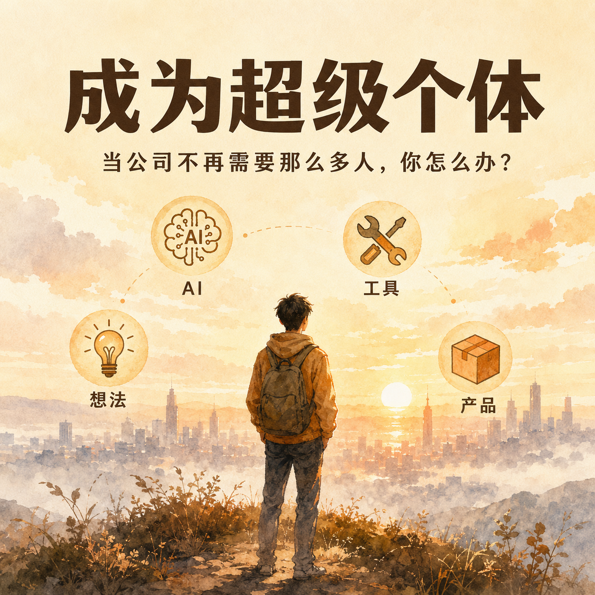
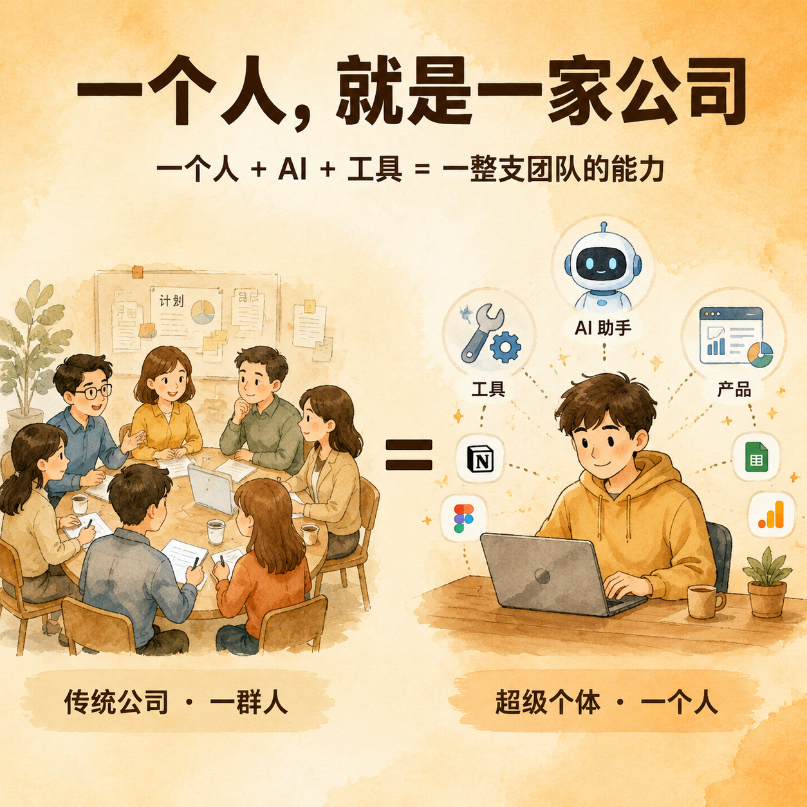

# 成为超级个体：当公司不再需要那么多人，你怎么办？

> 写给每一个，在这个时代里感到不安，但还没放弃自己的人。

---

## 这两年，你有没有这种感觉？

"裁员" 这个词，出现的频率越来越高。

先是大厂，后来是中厂，再后来连小公司也开始撑不住。
程序员被裁、设计被裁、产品被裁，运营、市场、行政、客服——几乎没有哪个岗位真的"安全"。

更让人心里发凉的，是这一次失业之后：
**找下一份工作，比想象中难得多。**

也不只是互联网。
做销售的、做内容的、做实体生意的朋友，处境同样焦虑。

我们都隐约意识到：这一次，和以前不一样。

不是经济周期，不是某个行业的寒冬，
而是 AI 正在以一种我们还没反应过来的速度，
重新分配 "价值" 和 "机会"。

---

## 那，未来的出路在哪里？

这段时间，我一直在想这个问题。

如果一个人写代码、做设计、写文案、做客服、做运营——这些事 AI 都能帮上忙，
那原本需要二十个人的公司，是不是一个人也能做了？

想着想着，我心里冒出一个词，
最近几乎挥之不去：

**「超级个体」。**

---

## 我心里的"超级个体"

不是天才，不是创业精英，更不是要你去做下一个英伟达。

> 一个普通人，借助 AI 和工具，
> 自己想、自己做、自己上线、自己迭代，
> 做出能解决问题、能被人使用、甚至能养活自己的产品。

他不需要先辞职、不需要先融资、不需要先组团队。
他可能在上班的间隙、在带娃的缝隙、在通勤的地铁上，
一点点把脑子里的想法，变成屏幕上可以打开的东西。

这条路，过去只属于程序员、产品经理、创业者。
而 AI，**好像正在把它变成普通人也有机会走的路。**

---

## 但我也有很多没想清楚的事

老实说，这只是我目前的一个判断，
我自己心里也还有很多打问号的地方：

- 真的所有岗位都能这样转型吗？还是只有一小部分人，才有这个机会？
- "超级个体" 听起来很美好，但一个人做产品，会不会其实更孤独、更难持续？
- AI 让 "做一个产品" 变容易了，那 "做出一个有人愿意用、愿意付费的产品" 是不是反而更难？
- 这到底是少数人的红利，还是一种新的、普遍的能力？

我不太确定。
所以与其自己一个人在脑子里反复打转，
不如把这些问题摊开来，一起聊。

---

> 你最近最焦虑的是什么？
> 你身边有没有人，已经在走 "一个人 + AI" 这条路？
> 又或者，你觉得 "超级个体" 这件事，本身就是个噱头？
>
> 不管是认同、是怀疑、还是觉得我想错了，
> 都欢迎在评论区聊聊你的看法。
>
> 这种事，一个人想不清楚，
> 大家一起想，可能更清楚一点。
