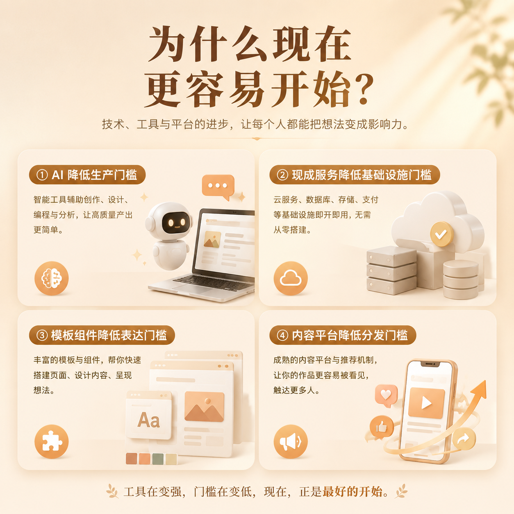

# 第 01 篇｜普通人也能做产品了：为什么偏偏是现在？

> 系列：普通人也能做产品  
> 副标题：你不需要先成为程序员，先理解为什么这件事在今天开始变得可行。  
> 标签：超级个体 / AI / 入门认知 / 产品  
> 难度：⭐ 入门认知  
> 阅读时长：约 9 分钟  
> 前置：无

---


## 这篇你会看懂什么？

看完这篇，你会先建立一个最重要的判断：

1. 为什么以前“做产品”听起来像一件只有团队才能做的事。
2. 为什么现在，一个普通人也开始有机会做出自己的工具、网站、产品。
3. 哪些门槛是真的下降了，哪些门槛其实并没有消失。
4. 你为什么可能正好处在一个适合开始的时间点。

---

## 先说结论

如果只用一句话概括这篇文章，那就是：

> **不是普通人突然变厉害了，而是做产品这件事的很多高门槛，被 AI 和现成工具压低了。**

以前你想做一个产品，常常意味着：

- 你要找程序员
- 你要找设计师
- 你要找服务器
- 你要想办法部署
- 你还要自己想怎么推广

现在虽然这些事情依然存在，但它们已经不再都需要一整支团队来完成。

---

## 先看一张图


```text
以前：
想法
  ↓
找产品 / 找设计 / 找开发 / 找运维 / 找推广
  ↓
投入很多时间和钱
  ↓
才有机会做出第一个版本

现在：
想法
  ↓
AI + 模板 + 在线服务 + 现成平台
  ↓
一个人先做出最小版本
  ↓
先拿反馈，再决定要不要继续放大
```

这就是今天最大的变化。

不是所有事情都变简单了，
而是：

> **你终于可以先做出一个小结果，再决定要不要投入更多。**

---

## 1. 以前普通人为什么很难做产品？

以前最大的难点，不是“没有想法”，而是：

> **想法和结果之间，隔着太多你自己做不了的环节。**

比如你有一个很好的点子：

- 想做一个收集客户信息的小网站
- 想做一个帮家长管理孩子作业的小工具
- 想做一个课程预约页面

在过去，你很快就会撞上这些问题：

### 第一，生产门槛高

你得有人写代码、有人做页面、有人配服务。

如果你自己不会，那就只能找别人。

### 第二，试错成本高

你还没验证这个想法有没有人需要，可能就已经花了不少钱和时间。

### 第三，等待成本高

很多事情不是你想开始就能开始，而是要等：

- 等开发排期
- 等设计出图
- 等部署上线
- 等别人有空帮你改

所以以前很多普通人不是没有想法，而是死在“还没开始就已经太重”这一步。

---

## 2. 为什么现在开始变了？

现在变化最大的，不是某一个工具，而是整条链路都变轻了。



### 变化一：AI 降低了生产门槛

以前你脑子里有想法，但不知道怎么把它变成页面、文案、代码、结构。

现在 AI 可以帮你：

- 写第一版页面文案
- 生成产品结构草图
- 解释技术词
- 写出初版代码
- 帮你排查明显错误

它不能代替你做最终判断，
但它能把很多“以前必须请人做”的第一步，先帮你启动起来。

### 变化二：现成服务降低了基础设施门槛

以前你一听“服务器、数据库、部署”，就像在听另一个世界的词。

现在大量服务已经把这些事情包装好了。

你不用先学会怎么搭机房，
很多时候只要学会怎么用现成平台。

### 变化三：模板和组件降低了表达门槛

以前很多人卡在“我不会设计”。

现在你不一定需要从一张白纸开始设计。
你可以：

- 用模板
- 用组件
- 用现成布局
- 让 AI 先给你一个可讨论的第一版

这会让“做出第一个能看、能用的东西”容易很多。

### 变化四：内容平台降低了分发门槛

以前做出来只是第一步，后面“怎么让别人知道”也很重。

现在你至少有更多低成本的起步方式：

- 公众号
- 小红书
- 抖音
- 知乎
- 社群
- 搜索内容

也就是说，
你不一定要先花很多广告预算，才能让第一批人看到你做的东西。

---

## 3. 那是不是现在谁都能随便成功？

不是。

这里一定要讲清楚：

> **门槛下降，不等于没有门槛。**

真正没有变化的，恰恰是最核心的几件事：

### 1）你还是要知道自己在帮谁解决问题

AI 能生成页面，但不能替你真正理解用户。

### 2）你还是要做判断

做什么、不做什么，先做哪个、后做哪个，这些都还是人的工作。

### 3）你还是要验证结果

AI 说“可以”，不代表真的可以。
你还是得自己看、自己试、自己确认。

### 4）你还是要持续推进

很多人不是败在不会，而是败在做了两天就停了。

所以更准确的说法应该是：

> **今天普通人更容易开始了，但真正能走下去的人，依然是那些愿意持续判断、持续验证、持续迭代的人。**

---

## 4. 谁最适合现在开始？

很多人以为最适合的人，是程序员。

其实不一定。

今天最适合开始的人，往往是这几类：

### 第一类：长期在某个行业里，知道真实问题的人

比如：

- 老师知道家长和学生最烦什么
- 销售知道客户最卡什么
- 运营知道内容生产最累什么
- 咨询师知道客户决策时最犹豫什么

这些人也许不会写代码，
但他们最接近真实需求。

### 第二类：本来就有表达能力的人

因为 AI 协作里一个非常重要的能力是：

> **你能不能把问题描述清楚。**

### 第三类：愿意先从小成果开始的人

不是一上来就想做“大平台”“大生意”，
而是先做一个：

- 小页面
- 小工具
- 小流程
- 小服务

这种人往往更容易真的跑出结果。

---

## 本篇小结

- 以前普通人很难做产品，主要不是没有想法，而是中间环节太重。
- 今天 AI、模板、在线服务、内容平台，一起把很多门槛压低了。
- 现在更容易开始，但不代表不需要判断、验证和持续迭代。
- 最适合开始的人，往往不是技术最强的人，而是最接近真实问题、最愿意先做出小结果的人。

---

## 小题

1. 为什么说今天最大的变化，不是“人人都会写代码了”，而是“很多高门槛被压低了”？
2. 你所在的行业里，有没有一个你反复见到、但一直没人认真解决的小问题？
3. 如果你现在要做一个最小成果，它更可能是什么：一个页面、一个表单、一个小工具，还是一个完整平台？为什么？

---

## 下一篇

继续看 [第 02 篇｜什么是超级个体：你离它并没有想象中那么远](./02-什么是超级个体-你离它并没有想象中那么远.md)
