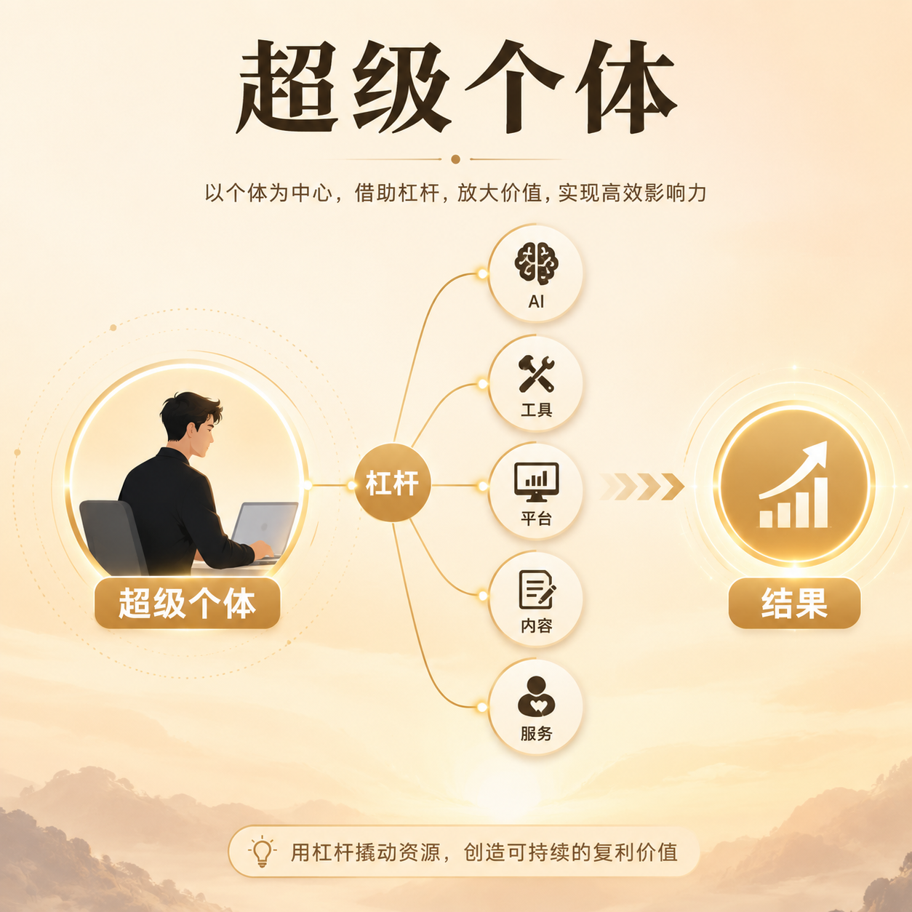

# 第 02 篇｜什么是超级个体：你离它并没有想象中那么远

> 系列：普通人也能做产品  
> 副标题：它不是“一个人什么都会”，而是一个人也能把价值交付链路跑起来。  
> 标签：超级个体 / 入门认知 / AI / 个人成长  
> 难度：⭐ 入门认知  
> 阅读时长：约 10 分钟  
> 前置：建议先读 [第 01 篇](./01-普通人也能做产品了-为什么偏偏是现在.md)

---



## 这篇你会看懂什么？

看完这篇，你会搞清楚：

1. “超级个体”到底在说什么。
2. 它和打工、自由职业、小团队、创业之间有什么区别。
3. 为什么它不是“一个人什么都亲自做”，而是“一个人可以把事情真正推进到结果”。
4. 为什么你离它并没有想象中那么远。

---

## 先说结论

很多人第一次听到“超级个体”这个词，会以为它在说一种非常厉害、非常遥远的人。

好像得同时会：

- 写代码
- 设计页面
- 做产品
- 写内容
- 拉增长
- 懂运营
- 会卖货

其实不是。

更准确的说法是：

> **超级个体，不是一个人什么都会，而是一个人能借助 AI、工具和现成服务，把想法推进成结果。**

它强调的不是“全能”，而是“杠杆”。

---

## 先看一张图

```text
传统个人工作：
我会什么 → 我就做什么 → 收入主要靠时间换钱

超级个体：
我知道要解决什么问题
  +
我会借助 AI、工具、平台、内容、服务
  ↓
把一个价值链路跑起来
  ↓
结果不只靠我的手工时间决定
```

这就是两者最本质的区别。

---

## 1. 超级个体到底是什么？

我更愿意用一句很朴素的话来解释它：

> **一个人，也能像一支很小的公司那样，把问题发现、价值设计、结果交付这条线跑起来。**

这里有三个关键词：

### 第一，发现问题

你要知道什么问题值得做。

### 第二，设计价值

你要知道准备拿什么东西去解决它。

### 第三，交付结果

你不是只停留在“我想过”，而是真的把它做出来、发出去、给别人用。

只要一个人能逐步做到这三件事，他就已经开始在走“超级个体”的路了。

---

## 2. 它和普通打工有什么区别？

打工当然没有问题，很多人也能在工作里成长得非常快。

但从结构上看，打工更像是：

> **你在某个系统里，负责其中一段。**

比如你只做：

- 设计
- 运营
- 后端
- 销售
- 内容

而超级个体更像是：

> **你开始学着看整条链路。**

你不一定每一环都自己做，
但你会关心：

- 这个问题值不值得做
- 这个页面为什么这样设计
- 这个功能为什么要上线
- 这个产品为什么没人用
- 这个结果为什么没有转化

也就是说，
超级个体不是“职位变化”，
而是：

> **你对结果负责的范围，开始变大了。**

---

## 3. 它和自由职业有什么区别？

很多人会把“超级个体”和“自由职业”画等号。

其实也不完全一样。


自由职业通常是：

- 我会一项技能
- 我用这项技能接单
- 我按项目、按时间、按交付收费

比如：

- 接设计稿
- 接文案
- 接开发单
- 接拍摄

而超级个体更像是：

- 我不只是卖技能
- 我开始尝试做自己的产品、服务、内容系统、流量系统
- 我希望让结果不再只靠我一个人的手工时间

你可以把它理解成：

> **自由职业更像“卖能力”，超级个体更像“做系统”。**

当然，很多人是从自由职业慢慢走向超级个体的。

---

## 4. 它和创业、小团队又有什么关系？

超级个体不是“反对创业”，也不是“我永远一个人”。

它更像是一种新的起步方式。

以前很多事情一上来就得：

- 组团队
- 拉合伙人
- 找钱
- 分工
- 先把架子搭起来

现在你可以先用一个人把最小版本做出来：

- 先验证问题是不是真的存在
- 先验证有没有人愿意用
- 先验证有没有人愿意付费

如果后面证明值得做，再考虑：

- 找合作伙伴
- 招人
- 扩团队
- 放大规模

所以超级个体不是创业的反义词，
它更像是：

> **在今天这个时代，一个人也可以先把“创业的前半段”跑起来。**

---

## 5. 为什么说你离它没有想象中那么远？

因为很多人以为，自己要等到“全都学会”了，才能开始。

但真实情况通常正好相反：

> **你是先开始做，才会慢慢补齐理解。**

比如你现在也许不会：

- 代码
- 设计
- 部署
- 增长

但你可能已经具备了另外一些更关键的东西：

- 你知道某个真实痛点
- 你有表达能力
- 你愿意持续学习
- 你愿意先从一个小成果做起

这些，反而是很多产品真正能跑起来的起点。

技术当然重要，
但在今天，
“不会技术”已经不再自动等于“完全不能开始”。

---

## 6. 成为超级个体，最核心的能力到底是什么？

如果只挑最核心的 4 个，我会选这几个：

### 1）判断力

什么值得做，什么不值得做。

### 2）表达力

能不能把问题说清楚，把需求讲明白，把想法传出去。

### 3）整合力

你不一定亲手做完每一环，
但你要知道怎么把 AI、工具、平台、内容和服务串起来。

### 4）推进力

很多人不是输在不会，而是输在停太早。

你要有能力把一件事从“想法”往前推到“结果”。

这 4 个能力，远比“我会不会某一个技术栈”更接近超级个体的本质。

---

## 本篇小结

- 超级个体不是“一个人什么都会”，而是“一个人可以借助杠杆，把价值链路跑起来”。
- 它和打工的区别，在于你开始对更完整的结果负责。
- 它和自由职业的区别，在于你不只是卖技能，而是开始做系统。
- 它和创业并不冲突，反而像是今天更轻量的起步方式。
- 你离这条路没有想象中那么远，因为真正关键的，往往不是先学会一切，而是先开始推进一个小结果。

---

## 小题

1. 为什么说“超级个体”强调的是杠杆，而不是全能？
2. 自由职业和超级个体最大的结构区别是什么？
3. 你现在手上最接近“可以推进成一个小结果”的问题是什么？

---

## 下一篇

继续看 [第 03 篇｜一个产品从想法到上线，中间到底会发生什么？](./03-一个产品从想法到上线-中间到底会发生什么.md)
