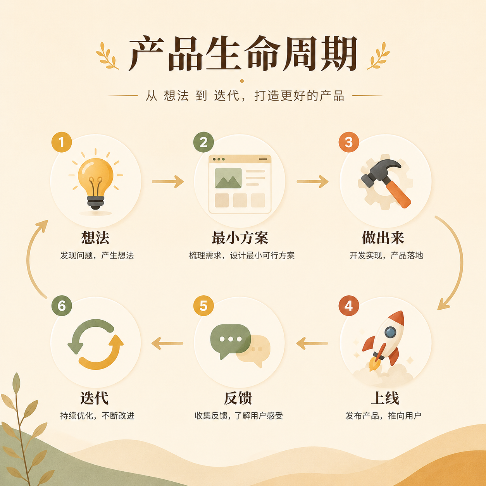

# 第 03 篇｜一个产品从想法到上线，中间到底会发生什么？

> 系列：普通人也能做产品  
> 副标题：先看懂整条链路，你才不会一上来就被细节吓住。  
> 标签：产品流程 / 入门认知 / 上线 / 全局地图  
> 难度：⭐ 入门认知  
> 阅读时长：约 10 分钟  
> 前置：建议先读 [第 01 篇](./01-普通人也能做产品了-为什么偏偏是现在.md) 和 [第 02 篇](./02-什么是超级个体-你离它并没有想象中那么远.md)

---



## 这篇你会看懂什么？

看完这篇，你会先建立一张完整地图：

1. 一个产品从想法到上线，大概会经过哪些环节。
2. 产品、设计、开发、上线、增长、迭代之间到底是什么关系。
3. 为什么普通人不用一开始就学会所有东西，但一定要先知道每一环在干什么。

---

## 先说结论

很多人一想到“做产品”，脑子里马上就会跳到：

- 写代码
- 做页面
- 配服务器

但真实情况是，
产品不是从“写代码”开始的，
也不是在“上线”那一刻就结束的。

它更像一条链路。

> **你先发现问题，再设计解决方案，再把它做出来、发出去、让人使用、收反馈、继续调整。**

如果你脑子里没有这张地图，
就很容易在任何一个局部环节里迷路。

---

## 先看一张全流程图

```text
发现问题
  ↓
想清楚要解决什么
  ↓
设计一个最小方案
  ↓
把它做出来
  ↓
部署上线
  ↓
让别人看到并使用
  ↓
拿到反馈
  ↓
继续调整和迭代
```

你可以把它理解成：

> **一个产品不是“做出来”就完了，而是“做出来之后开始进入真实世界”。**

---

## 1. 第一步：先发现问题，而不是先想功能

很多初学者最容易犯的错误是：

> “我想做一个很厉害的网站。”

但“很厉害”不是问题，
“我想加一个登录页”也不是问题。

真正的起点应该是：

- 谁遇到了什么麻烦？
- 这个麻烦是不是值得解决？
- 这个问题会不会有人愿意为它停下来？

比如：

- 家长总记不清课程安排
- 小商家总是手工回复同样的问题
- 内容创作者总在重复整理资料

这些，才是产品真正该开始的地方。

---

## 2. 第二步：先想最小方案，而不是先想“大而全”

确定问题后，下一步不是马上把脑子里所有功能都做出来。


下一步应该是：

> **我能不能先用一个最小版本，验证这件事值不值得继续做？**

这就叫“最小方案”。

比如：

- 先做一个预约表单，而不是完整管理系统
- 先做一个信息页，而不是完整平台
- 先做一个能跑通的小工具，而不是十几个功能模块

很多产品不是死在能力不够，
而是死在一开始做太大。

---

## 3. 第三步：设计和开发，是把想法变成可用的东西

当你有了最小方案，
才会进入下面这两个看起来更“技术”的环节：

### 设计在解决什么？

设计不是把页面弄漂亮。

它在解决的是：

- 用户能不能看懂
- 信息顺不顺
- 操作是不是自然
- 页面有没有让人继续往下走

### 开发在解决什么？

开发不是为了显得专业。

它在解决的是：

- 这个页面能不能真的运行
- 这个按钮点下去会不会有结果
- 这个数据能不能被保存
- 这个系统能不能稳定工作

也就是说：

> **设计负责“让人愿意用”，开发负责“让它真的能用”。**

---

## 4. 第四步：上线，是把产品从你电脑里送到别人面前

很多人会以为“我本地跑起来了”，就已经算做完了。

其实不是。

你电脑里能打开，
和别人也能打开，
是两回事。

上线的意义，就是：

- 给它一个地址
- 把它放到互联网上
- 让别人真的可以访问

这一步通常会涉及：

- 域名
- 部署
- 运行环境
- 数据保存

你现在先不用会操作，
但你要知道：

> **一个产品想给别人用，上线这一步绕不过去。**

---

## 5. 第五步：有人用，产品才算真正开始

这是很多人最容易忽略的一步。

很多人把“做出来了”当成终点。

但真实世界里，
“做出来”只是起点。

因为你接下来还会遇到：

- 没人知道它
- 有人进来了但看不懂
- 有人用了但没留下
- 有人觉得不错，但不愿意付费

所以你还要面对：

- 怎么让人看到
- 怎么让人理解
- 怎么让人愿意留下
- 怎么让人愿意继续回来

这部分，很多时候比“做出来”更难。

---

## 6. 第六步：反馈和迭代，决定它能不能活下去

一个产品不是做完就结束。

它最后能不能活下来，
常常取决于你愿不愿意根据反馈去改。

反馈可能来自：

- 用户直接说的话
- 数据里的异常
- 哪个页面没人点
- 哪个环节流失很严重
- 你自己反复使用时发现的笨重之处

所以迭代不是“不断加功能”，
而是：

> **不断让产品更贴近真实需求。**

---

## 7. 普通人最容易误解的地方是什么？

最常见的误解有两个：

### 误解一：做产品 = 写代码

不对。

写代码只是其中一个环节。

### 误解二：做出来 = 成功了

也不对。

做出来，只说明你完成了“从想法到上线”的前半段。
真正的考验，是它能不能进入真实世界并活下来。

所以你现在最需要建立的，不是某个单点技能，
而是：

> **一张完整地图。**

有了这张地图，你以后看到任何技术词、产品词、运营词，都不容易彻底慌掉。

---

## 本篇小结

- 一个产品从想法到上线，不是一跳就到，而是一条完整链路。
- 这条链路通常包括：发现问题、设计最小方案、做出来、上线、被人看到、拿反馈、继续迭代。
- 设计和开发只是中间环节，不是全部。
- 上线不是终点，真实用户和真实反馈才是产品真正开始的地方。

---

## 小题

1. 为什么说“写代码”不是做产品的起点，也不是全部？
2. 你现在脑子里有没有一个问题，是可以先用“最小版本”验证的？
3. 如果一个产品上线后没人知道，它算真正完成了吗？为什么？

---

## 下一篇

继续看 [第 04 篇｜AI 不是魔法：它在做产品这件事里到底扮演什么角色？](./04-AI不是魔法-它在做产品这件事里到底扮演什么角色.md)
