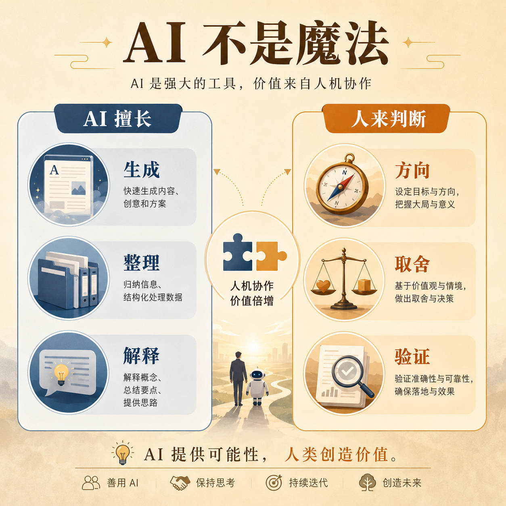
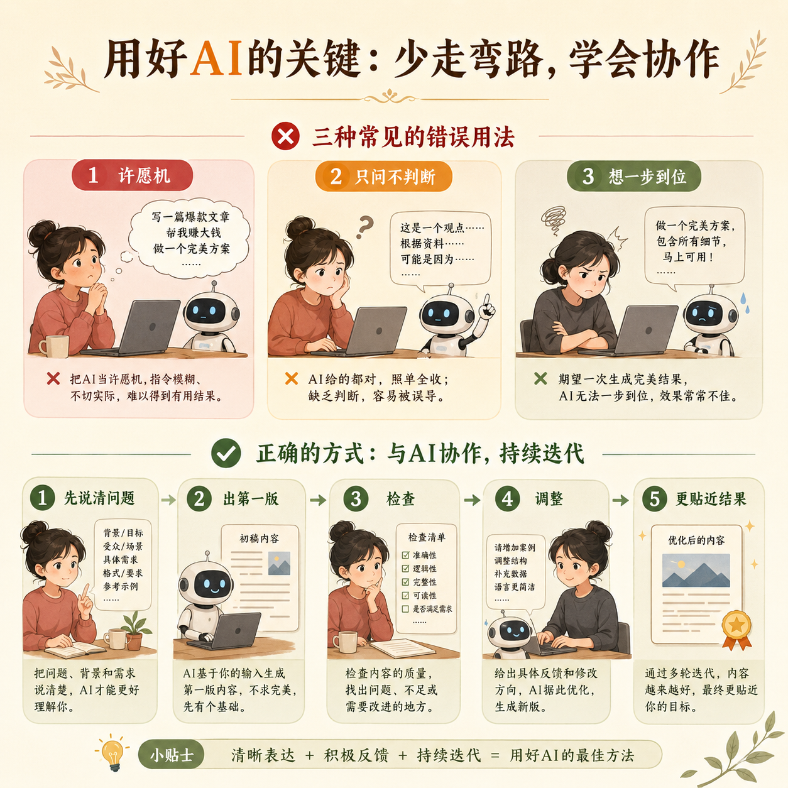

# 第 04 篇｜AI 不是魔法：它在做产品这件事里到底扮演什么角色？

> 系列：普通人也能做产品  
> 副标题：把 AI 当成高执行力助手，而不是全知全能的许愿机。  
> 标签：AI / 协作方式 / 入门认知 / 工作流  
> 难度：⭐ 入门认知  
> 阅读时长：约 10 分钟  
> 前置：建议先读 [第 03 篇](./03-一个产品从想法到上线-中间到底会发生什么.md)

---



## 这篇你会看懂什么？

看完这篇，你会更清楚：

1. AI 在做产品这件事里，到底适合做什么。
2. AI 最不适合替你做什么。
3. 为什么很多人用了 AI 还是做不出结果。
4. 一个普通人和 AI 最合适的协作方式是什么。

---

## 先说结论

现在很多人一提到 AI，就会走向两个极端：

- 要么觉得它无所不能
- 要么觉得它不靠谱，干脆别用

其实这两个判断都不准确。

更准确的说法是：

> **AI 最擅长的是加速“生产”和“整理”，最不擅长的是替你承担“判断”和“后果”。**

这句话非常重要。

因为你后面做产品、写内容、搭网站、做页面、跑流程，
几乎都会不断遇到这个分界线。

---

## 先看一张分工图

```text
更适合 AI 做的：
- 起草
- 整理
- 改写
- 生成第一版
- 解释概念
- 提供多个方案
- 加速重复劳动

更适合人做的：
- 选方向
- 定优先级
- 判断真需求
- 决定取舍
- 验证结果
- 承担后果
```

你可以把 AI 理解成一个：

> **非常能干、非常快，但并不真正理解你现实处境的助手。**

---

## 1. AI 最擅长帮你做什么？

### 第一，帮你从“空白”进入“第一版”

很多人最大的卡点，不是不会改，
而是：

- 不知道从哪开始
- 不知道第一句怎么写
- 不知道第一版页面长什么样
- 不知道第一个方案怎么列

这时 AI 很有价值。

它可以帮你：

- 写出第一版文案
- 列出结构大纲
- 生成页面草图思路
- 写出第一版代码
- 把模糊想法变成可讨论的东西

### 第二，帮你加速重复劳动

比如：

- 改写同一段文案的不同版本
- 总结长内容
- 整理会议笔记
- 生成表格
- 批量处理一些重复任务

### 第三，帮你补齐认知缺口

你不懂某个词、某个流程、某个概念时，
AI 很适合先帮你解释成你能听懂的话。

所以很多时候，
AI 最大的价值不是“替你做完”，
而是：

> **让你更快跨过“我完全不知道这是什么”的那道坎。**

---

## 2. AI 最不适合替你做什么？

### 第一，替你判断什么值得做

AI 可以帮你列出 10 个想法，
但它不知道：

- 哪个问题是你最熟的
- 哪个用户你最懂
- 哪个方向最适合你当前阶段

### 第二，替你判断结果好不好

AI 可以说“这个页面不错”，
但到底用户会不会看懂、会不会点击、会不会买单，
最后还是要你自己验证。

### 第三，替你承担现实后果

如果一个按钮写错、一个价格定错、一个邮箱配置错、一个流程把用户劝退，
真正承担后果的人不是 AI，而是你。

所以一定要记住：

> **AI 可以替你做草稿，但不能替你负责。**

---

## 3. 为什么很多人用了 AI，还是做不出结果？

不是因为 AI 没用，
而是因为他们把 AI 用错了。



最常见的 3 种错法：

### 错法一：把 AI 当许愿机

一句话丢过去：

- 帮我做个产品
- 帮我搞个网站
- 帮我写个系统

结果当然很容易失控。

因为问题太大、太空、太模糊。

### 错法二：只会问，不会判断

AI 给了答案就信，
不给验证，不做对比，也不放回现实里看。

这样很容易把“能说得通”误以为“真的能用”。

### 错法三：想一步到位

很多人希望一轮对话就得到最终成品。

但真正高质量的结果，通常都来自一个循环：


```text
先说清楚问题
  ↓
AI 生成第一版
  ↓
你检查哪里不对
  ↓
再让 AI 调整
  ↓
反复几轮后，结果越来越贴近你要的东西
```

所以 AI 更像“协作过程”，而不是“一键成品按钮”。

---

## 4. 普通人和 AI 最好的协作方式是什么？

我更推荐你把 AI 当成下面这 4 种角色：

### 1）解释员

你不懂一个词，就让它先讲人话。

### 2）起草员

你不知道怎么开始，就让它先出第一版。

### 3）整理员

你脑子里很乱，就让它帮你梳理结构。

### 4）陪练员

你不确定自己的想法清不清楚，就让它反问你、挑战你、帮你补漏洞。

这四种用法，对普通人尤其有帮助。

因为你一开始最缺的，不一定是能力，
而是：

- 把事情讲清楚
- 把事情拆明白
- 把事情先推进一步

而 AI 恰好能帮你补这些环节。

---

## 5. 所以普通人到底该怎么开始用 AI？

先别想太大。

你可以先从这 3 种最简单的用法开始：

### 用法一：让它解释

比如：

- GitHub 是什么
- 域名和服务器有什么区别
- 登录功能到底在解决什么

### 用法二：让它帮你起草

比如：

- 帮我写一个产品介绍第一页
- 帮我列一个网站首页结构
- 帮我把这个想法整理成 5 个步骤

### 用法三：让它陪你拆问题

比如：

- 如果我是完全不懂技术的人，第一步该先做什么？
- 这个想法最大的问题是什么？
- 我现在最适合先做哪一个最小版本？

这样用，AI 会更像一个真正的协作者。

---

## 本篇小结

- AI 不是魔法，它最擅长的是生成、整理、解释和加速。
- AI 最不适合替你做的是方向判断、结果判断和现实后果承担。
- 很多人用了 AI 还是做不出结果，不是因为 AI 没用，而是因为把它当成了许愿机。
- 对普通人最有价值的用法，往往是：解释、起草、整理、陪练。

---

## 小题

1. 为什么说“AI 可以替你做草稿，但不能替你负责”？
2. 你平时最适合先把 AI 当成哪一种角色：解释员、起草员、整理员，还是陪练员？
3. 你最近遇到的一个问题里，哪一部分其实已经很适合交给 AI 先帮你起个头？

---

## 下一篇

继续看 [第 05 篇｜GitHub 到底是什么：为什么你总会一再听到它？](./05-GitHub到底是什么-为什么你总会一再听到它.md)
