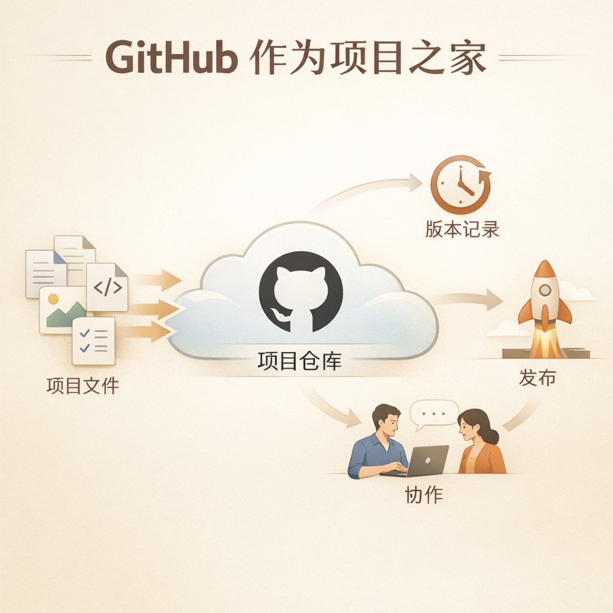
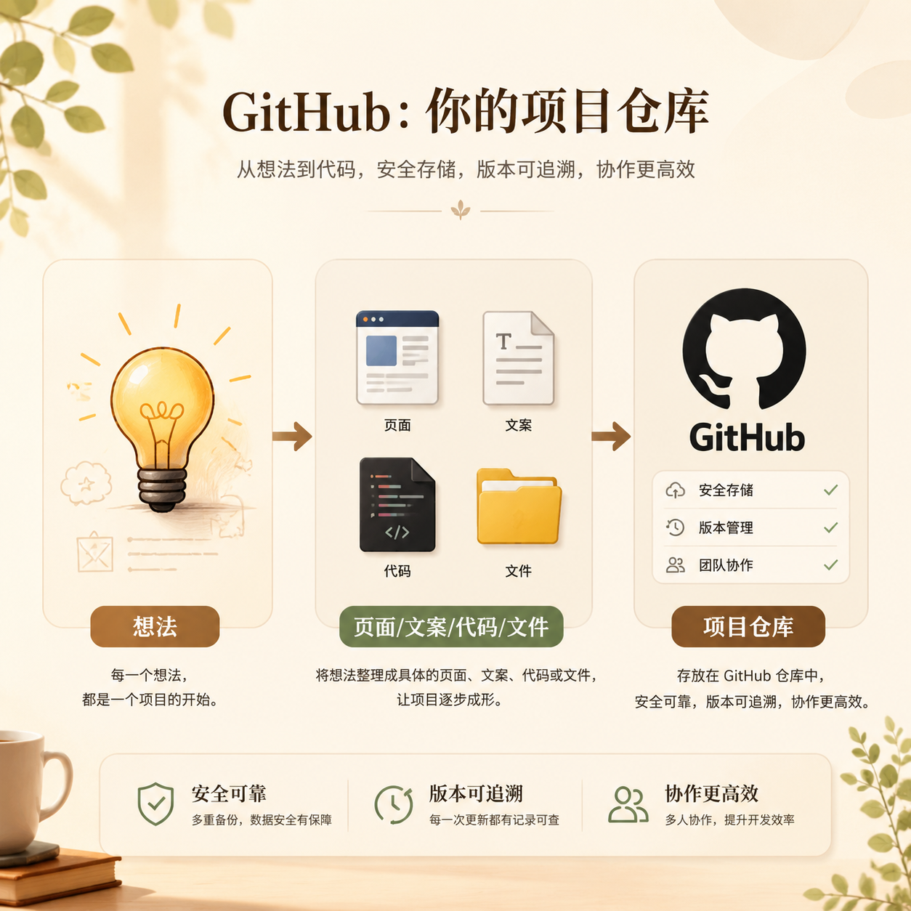

# 第 05 篇｜GitHub 到底是什么：为什么你总会一再听到它？

> 系列：普通人也能做产品  
> 副标题：先听懂 GitHub 在整个链路里负责什么，你后面很多技术词就不会再那么吓人。  
> 标签：GitHub / 入门认知 / 技术词 / 产品基础  
> 难度：⭐ 入门认知  
> 阅读时长：约 9 分钟  
> 前置：建议先读 [第 03 篇](./03-一个产品从想法到上线-中间到底会发生什么.md)

---



## 这篇你会看懂什么？

看完这篇，你会知道：

1. GitHub 到底是什么。
2. 为什么很多做网站、做产品、做项目的人都会提到它。
3. 它和保存、协作、发布之间是什么关系。
4. 为什么你现在可以先听懂它，不着急马上学会所有操作。

---

## 先说结论

如果只讲一句最简单的话，那就是：

> **GitHub 是一个专门放项目内容、记录变化、方便协作和发布的地方。**

很多人第一次听到 GitHub，都会误以为它是：

- 一个写代码的软件
- 一个做网站的平台
- 一个只有程序员才会用的社区

其实都不完全对。

它最核心的价值，是：

> **帮你把项目放在一个可靠、可回看、可分享、可协作的位置上。**

---

## 先看一张图



```text
你脑子里的想法
  ↓
变成页面 / 文案 / 代码 / 文件
  ↓
需要一个地方好好存起来
  ↓
GitHub 就常常扮演这个“项目仓库”的角色
```

所以你可以先把 GitHub 理解成：

> **项目的云端仓库。**

---

## 1. 为什么很多人一开始就会听到 GitHub？

因为在今天，大量后续动作都会和它连起来。

比如：

- 你要保存项目内容
- 你要记录每次修改
- 你要把项目发给别人看
- 你要接入部署平台
- 你要让 AI 或别人帮你一起改

这些事情后面很容易都绕回 GitHub。

所以它常常被当成“起点”。

不是因为它神秘，
而是因为它在整条链路里，位置很基础。

---

## 2. GitHub 最像什么？

对普通人来说，最容易理解的类比不是“代码托管平台”这种说法。

更容易理解的是这三个类比：

### 类比一：云端仓库

你做出来的项目内容，总要有地方存。
GitHub 就像一个放项目文件的云端仓库。

### 类比二：版本记录本

你今天改了什么、明天改了什么，
它可以帮你保留痕迹。

### 类比三：协作中枢

以后如果有别人帮你看、帮你改、帮你协作，
你们通常得围绕同一个地方来工作。

所以最简单的理解是：

> **GitHub 像“项目仓库 + 版本记录本 + 协作中枢”。**

---

## 3. 如果没有 GitHub，会怎么样？

当然不是说没有 GitHub 就完全不能做事。

但如果没有这样一个中心位置，你很容易遇到这些问题：

### 第一，项目只在你自己电脑里

电脑坏了、误删了、换机器了，麻烦会很大。

### 第二，你不知道自己改了什么

改来改去之后，突然发现哪里不对，
却说不清到底是从哪一步开始变坏的。

### 第三，不方便协作

如果未来有人想帮你看内容、看结构、看代码，
没有统一位置会很乱。

### 第四，不方便接后续平台

很多部署平台、自动化平台、开发工具，
都很喜欢直接和 GitHub 打通。

所以 GitHub 不是“锦上添花”，
而更像：

> **后面很多动作愿不愿意顺畅，取决于前面有没有把项目放进一个好用的仓库。**

---

## 4. GitHub 和“做产品”到底是什么关系？

很多普通人会问：

> “我又不是程序员，为什么我也要知道 GitHub？”

答案是：

因为你不一定是在学“代码”，
你是在学“怎么把一个项目稳定地推进下去”。

而 GitHub 在这里解决的，不只是技术问题，
更是项目管理问题。

它帮你处理的是：

- 内容有没有地方放
- 修改有没有痕迹
- 协作有没有中心
- 发布能不能接上

所以它的重要性，不在于它有多技术，
而在于：

> **它让你的项目开始像一个真正的项目，而不是一堆散落在电脑里的文件。**

---

## 5. 你现在需要会到什么程度？

你现在不需要：

- 一下子学会所有 Git 命令
- 搞懂什么分支、合并、PR
- 会所有高级协作流程

你现在只需要先建立一个认知：

> **GitHub 是后面很多项目动作的基础设施之一。**

知道这一点就够了。

等你下一步真的开始注册、建仓库、推内容，
再进入对应专题，一步一步学。

也就是说：

- 这一篇负责让你不怕这个词
- 专题文章负责教你怎么具体操作

---

## 本篇小结

- GitHub 不是写代码的软件，也不只是程序员社区。
- 它更像项目的云端仓库、版本记录本和协作中枢。
- 很多后续平台和流程都会围绕它展开，所以你总会一再听到它。
- 你现在不需要一下子学会操作，只需要先理解它在整条链路里负责什么。

---

## 小题

1. 为什么说 GitHub 更像“项目仓库”，而不只是一个技术网站？
2. 如果一个项目没有统一的云端位置，最容易出什么问题？
3. 你现在更容易把 GitHub 理解成：仓库、记录本，还是协作中枢？为什么？

---

## 延伸阅读

如果你想直接开始操作，可以去看专题文章：

- [如何注册 GitHub](../专题/01-如何注册-github.md)
- [从 0 开始建立一个仓库](../专题/02-从0开始建立一个仓库.md)

---

## 下一篇

继续看 [第 06 篇｜网站、网页、前端、后端：这些词一次讲明白](./06-网站网页前端后端-这些词一次讲明白.md)
