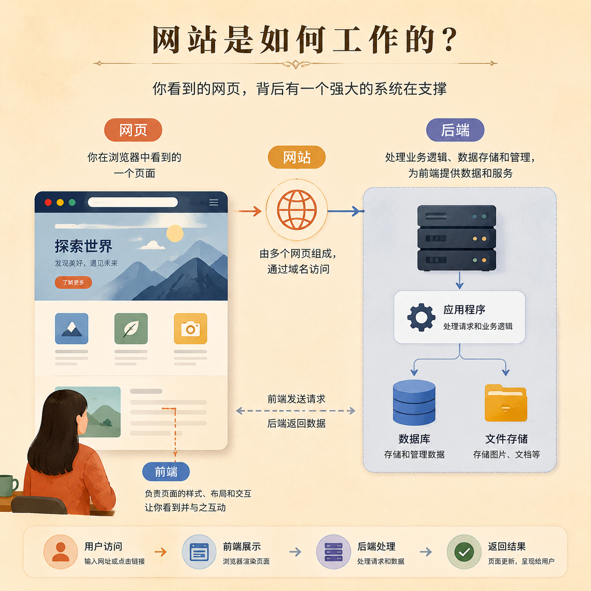
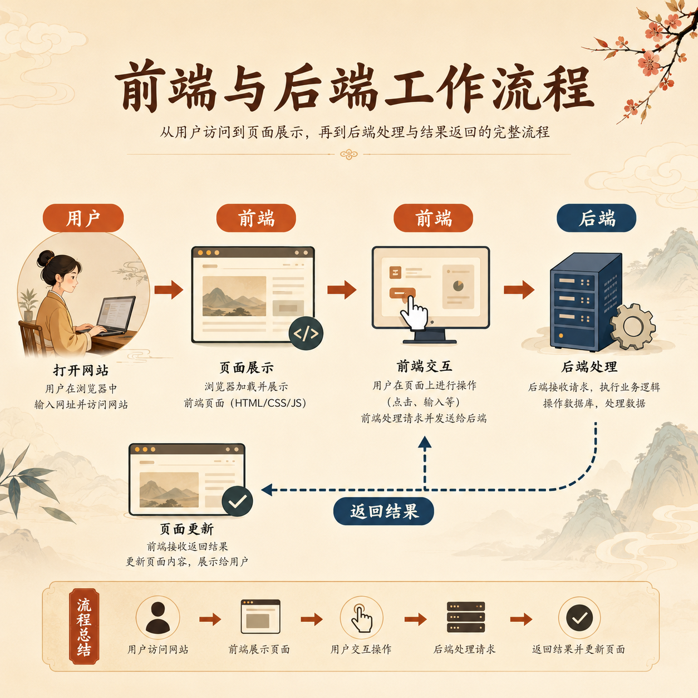

# 第 06 篇｜网站、网页、前端、后端：这些词一次讲明白

> 系列：普通人也能做产品  
> 副标题：先把这些最常见、最容易混的词分清楚，后面很多内容就不会再像天书。  
> 标签：网站 / 前端 / 后端 / 入门认知 / 技术词  
> 难度：⭐ 入门认知  
> 阅读时长：约 10 分钟  
> 前置：建议先读 [第 05 篇](./05-GitHub到底是什么-为什么你总会一再听到它.md)

---



## 这篇你会看懂什么？

看完这篇，你会分清：

1. 网站和网页有什么区别。
2. 前端和后端分别在做什么。
3. 为什么很多产品表面看起来只是一个页面，背后却有一整套系统。
4. 以后再听到这些词时，你脑子里应该浮现什么画面。

---

## 先说结论

最简单的理解是：

- **网页**：你看到的某一个具体页面
- **网站**：由很多页面和功能组成的整体
- **前端**：用户眼睛能看到、手能操作到的那一层
- **后端**：用户看不到，但在背后处理逻辑和数据的那一层

如果记不住那么多定义，
你先记住一句话：

> **前端负责“让人用”，后端负责“让东西真的跑起来”。**

---

## 先看一张图



```text
用户打开一个网站
  ↓
看到页面、按钮、文字、图片
  ↓
这是前端

用户点了按钮
  ↓
系统去判断、计算、保存、返回结果
  ↓
这是后端
```

这两个部分通常是连在一起工作的。

---

## 1. 网站和网页，到底有什么区别？

很多人会把这两个词混着用。

其实：

### 网页

网页更像一本书里的某一页。

比如：

- 首页
- 登录页
- 课程详情页
- 文章页

这些都可以叫网页。

### 网站

网站更像整本书，或者整家店。

它包含：

- 不止一个页面
- 多个入口
- 多种功能
- 有时还有后台、登录、数据系统

所以：

> **网页是一个页面，网站是一个整体。**

你平时说“我想做个网站”，
通常不是只想做一张页面，
而是想做一个能承载内容、功能和用户的整体东西。

---

## 2. 前端到底是什么？

前端就是：

> **用户直接看到和直接操作的部分。**

比如：

- 页面排版
- 颜色样式
- 按钮
- 输入框
- 菜单
- 图片
- 页面跳转

这些都属于前端范围。

所以如果你打开一个网站，
看到：

- 这个页面好不好看
- 这个按钮好不好点
- 这个布局顺不顺
- 这个信息你能不能一眼看懂

这些体验，很多都和前端有关。

你可以把前端想成：

> **用户和产品直接接触的那一层表面。**

---

## 3. 后端到底是什么？

后端就是：

> **用户通常看不到，但系统在背后处理事情的部分。**

比如：

- 登录后验证你是谁
- 保存你提交的表单
- 读取数据库里的内容
- 发送邮件
- 处理支付
- 生成某个结果再返回给页面

这些动作，很多都不是在屏幕表面完成的，
而是在系统背后完成的。

所以你可以把后端想成：

> **产品背后的工作间。**

前面是门店，
后面是厨房、仓库、账本和处理中心。

---

## 4. 为什么很多产品表面看起来很简单，背后却很复杂？

因为用户只看到前台那一层。

比如你看到一个登录框，
表面上只是：

- 输入邮箱
- 点一个按钮

但背后可能已经发生了：

- 判断输入是否合法
- 生成验证码
- 发一封邮件
- 保存这次验证码记录
- 校验有效时间
- 登录成功后保存会话状态

也就是说：

> **简单的表面，往往对应着不简单的后端流程。**

所以以后你看到一个产品“就一个页面”，
不要轻易以为它就“很简单”。

---

## 5. 普通人为什么也要理解前端和后端？

不是为了让你立刻去写代码。

而是因为你以后无论：

- 和 AI 沟通
- 看教程
- 提需求
- 做产品判断
- 找人协作

都会不断听到这两个词。

如果你脑子里完全没画面，
就会很容易慌。

但只要你先建立一个基础认知：

- 前端是表面体验
- 后端是背后处理

后面很多技术词你都能慢慢挂上去。

---

## 本篇小结

- 网页是单个页面，网站是由多个页面和功能组成的整体。
- 前端是用户能看到和操作的部分。
- 后端是用户看不到，但在背后处理逻辑和数据的部分。
- 很多看起来简单的产品，背后其实有完整的后端流程在支撑。

---

## 小题

1. 网站和网页最大的区别是什么？
2. 登录页里的输入框和按钮，更偏前端还是后端？为什么？
3. 一个表面很简单的页面，背后为什么可能并不简单？

---

## 下一篇

继续看 [第 07 篇｜服务器、数据库、域名：它们其实在帮你干什么？](./07-服务器数据库域名-它们其实在帮你干什么.md)
