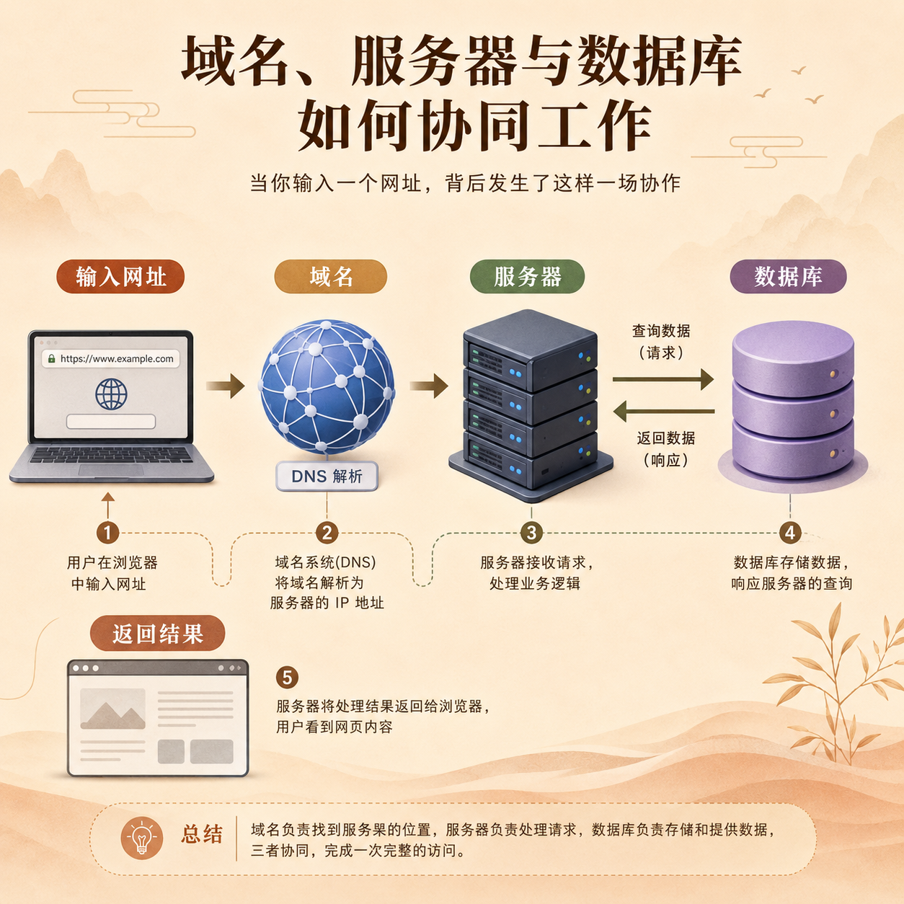

# 第 07 篇｜服务器、数据库、域名：它们其实在帮你干什么？

> 系列：普通人也能做产品  
> 副标题：这些听起来很技术的词，其实都在帮一个产品完成非常具体的工作。  
> 标签：服务器 / 数据库 / 域名 / 入门认知 / 基础设施  
> 难度：⭐ 入门认知  
> 阅读时长：约 10 分钟  
> 前置：建议先读 [第 06 篇](./06-网站网页前端后端-这些词一次讲明白.md)

---


## 这篇你会看懂什么？

看完这篇，你会知道：

1. 服务器到底是什么。
2. 数据库到底是什么。
3. 域名到底是什么。
4. 为什么这三个词经常会一起出现。

---

## 先说结论

如果先讲最白话的版本：

- **服务器**：替你 24 小时接待用户、运行网站的机器或服务
- **数据库**：替你保存信息、记录数据的地方
- **域名**：别人找到你这个产品时输入的网址名字

你可以把它们理解成：

- 服务器像店员
- 数据库像账本和仓库
- 域名像门牌号

这三个东西，常常一起组成一个产品的基础设施。

---

## 先看一张图



```text
用户输入网址
  ↓
通过域名找到你的网站
  ↓
服务器接住这次访问
  ↓
如果需要数据，就去数据库里读或写
  ↓
把结果返回给用户
```

看到这张图，你先不用记术语，
你只要知道：

> **它们三个是在一起配合工作的。**

---

## 1. 服务器到底是什么？

服务器最简单的理解就是：

> **一个负责让你的网站持续运行、持续响应别人访问的地方。**

你可以把它想成一个不下班的店员。

别人什么时候来访问：

- 上午来
- 晚上来
- 半夜来

它都在那里。

所以服务器解决的是：

- 你的网站放哪运行
- 别人访问时谁来接住
- 某个功能被点击后，谁去处理

很多普通人听到“服务器”，会自动脑补成很重、很难、很贵的东西。

但你现在先不用把它想成机房，
很多时候你接触到的是：

- 托管平台
- 云服务
- 部署平台

它们只是把“服务器”这件事包装得更容易用了。

---

## 2. 数据库到底是什么？

数据库最简单的理解是：

> **一个专门用来保存和管理数据的地方。**

比如这些内容都需要地方存：

- 用户信息
- 文章内容
- 订单记录
- 表单提交
- 登录验证码
- 反馈信息

如果没有数据库，会发生什么？

- 用户今天填过的信息，明天系统就不记得了
- 你发布的内容没地方存
- 用户操作之后，系统不能长期记住结果

所以你可以把数据库想成：

> **项目的账本、档案柜和记录中心。**

它不是给程序员炫技的东西，
而是几乎所有产品都绕不过去的一部分。

---

## 3. 域名到底是什么？

域名最简单的理解是：

> **一个人类更容易记住的网址名字。**

比如：

- `github.com`
- `vercel.com`
- `baidu.com`

这些就是域名。

如果没有域名，
理论上你也许还能用一串很难记的地址访问某个东西，
但现实里几乎没人愿意这么用。

所以域名在解决的是：

- 别人怎么记住你
- 别人怎么找到你
- 你的产品对外叫什么名字

你可以把它理解成：

> **你产品在互联网上的门牌号。**

---

## 4. 为什么这三个词总是一起出现？

因为一个产品只要想真的给别人用，
通常就要同时解决三件事：

### 第一，别人怎么找到你

这对应域名。

### 第二，别人来的时候谁接待

这对应服务器。

### 第三，数据怎么被记住

这对应数据库。

少了其中任何一个，
一个产品都会很难真正稳定地跑起来。

所以你以后听到：

- 买域名
- 部署到服务器
- 连数据库

不要把它们当成三个毫不相干的难词。

它们其实都在解决：

> **一个产品怎样真的在互联网里活起来。**

---

## 5. 你现在需要会操作吗？

现在不一定。

你当前阶段最重要的，不是立刻去配置所有东西，
而是先建立认知：

- 域名负责“找到你”
- 服务器负责“接住访问”
- 数据库负责“记住数据”

等你后面真正开始做网站、接功能、跑登录、发邮件，
你再去看对应专题文章，一步一步学具体做法。

所以这一篇的目标不是让你立刻操作，
而是：

> **让你先不再怕这些词。**

---

## 本篇小结

- 服务器是在背后运行和接待访问的地方。
- 数据库是保存和管理数据的地方。
- 域名是别人找到你产品时使用的网址名字。
- 这三者经常一起出现，因为它们共同构成了一个产品最基础的运行条件。

---

## 小题

1. 域名、服务器、数据库，各自最白话的作用分别是什么？
2. 如果一个网站没有数据库，它最容易缺少什么能力？
3. 为什么说这三个词不是各说各的，而是在一起配合工作？

---

## 下一篇

继续看 [第 08 篇｜登录、支付、邮件、表单：为什么产品总离不开这些功能？](./08-登录支付邮件表单-为什么产品总离不开这些功能.md)
