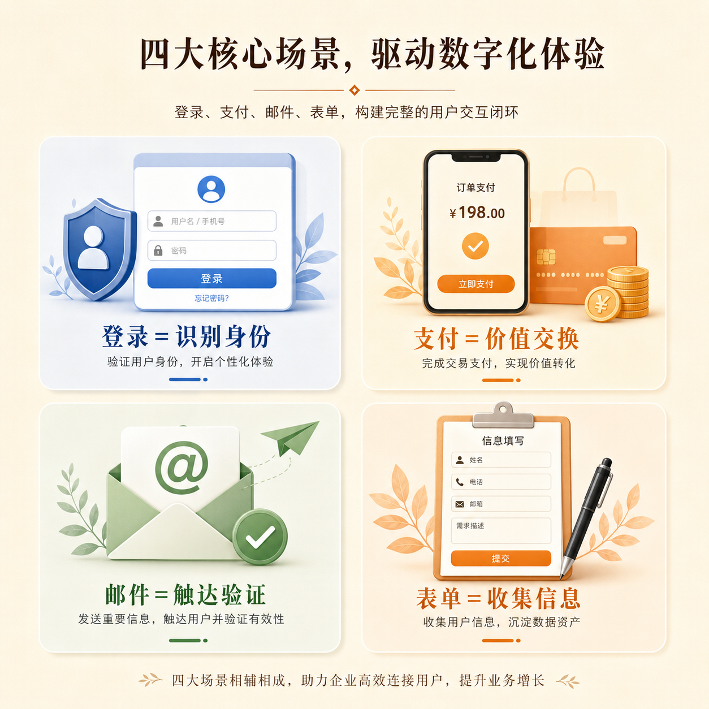

# 第 08 篇｜登录、支付、邮件、表单：为什么产品总离不开这些功能？

> 系列：普通人也能做产品  
> 副标题：很多看似普通的功能，其实都在产品里承担着非常关键的职责。  
> 标签：登录 / 支付 / 邮件 / 表单 / 入门认知  
> 难度：⭐ 入门认知  
> 阅读时长：约 9 分钟  
> 前置：建议先读 [第 07 篇](./07-服务器数据库域名-它们其实在帮你干什么.md)

---



## 这篇你会看懂什么？

看完这篇，你会知道：

1. 登录功能到底在解决什么。
2. 支付功能为什么不是“可有可无”。
3. 邮件功能为什么在很多产品里都会出现。
4. 表单为什么是很多产品的最小起点。

---

## 先说结论

很多人第一次做产品时，会把这些功能理解成：

- 登录：就是让人输密码
- 支付：就是收钱
- 邮件：就是发消息
- 表单：就是填一堆格子

但从产品角度看，它们真正解决的是：

- **登录**：识别“你是谁”
- **支付**：完成“价值交换”
- **邮件**：完成“触达、通知、验证”
- **表单**：完成“信息收集”

所以它们不是小零件，
而是很多产品的关键模块。

---

## 先看一张图

```text
登录    → 识别身份
支付    → 完成交易
邮件    → 建立触达和验证
表单    → 收集信息
```

你可以先记住：

> **这些功能的背后，真正解决的都不是表面动作，而是业务问题。**

---

## 1. 登录在解决什么？

登录最根本的问题不是“让用户输密码”，
而是：

> **系统要知道你是谁。**

比如：

- 哪篇内容你已经看过
- 哪个订单是你的
- 哪份资料是你的
- 哪条记录该显示给你

如果没有登录，
很多个性化和私有化能力都很难成立。

所以登录本质上在解决的是：

- 身份识别
- 用户状态
- 私有数据归属

---

## 2. 支付在解决什么？

支付不是单纯“收一笔钱”。

它在解决的是：

> **一个产品怎样把价值交换真正完成。**

比如：

- 用户买一节课
- 用户订阅一个服务
- 用户购买一个模板
- 用户解锁一项功能

这背后不仅仅是“钱到了没有”，
还包括：

- 谁付的
- 付了多少
- 付完之后该开通什么
- 订单有没有记录

所以支付在产品里，
其实是“变现”这件事的核心环节之一。

---

## 3. 邮件在解决什么？

很多人以为邮件只是“发通知”。

其实邮件在产品里的角色通常比这个更大。

它常常用来：

- 发送验证码
- 重置密码
- 发送注册确认
- 发送订单通知
- 发送重要提醒

所以邮件真正解决的是：

- 触达
- 验证
- 确认
- 提醒

你可以把它理解成：

> **产品和用户之间的一条外部沟通通道。**

---

## 4. 表单在解决什么？

表单常常是被低估的功能。

很多产品最早期甚至不需要复杂系统，
只需要一个表单就能开始。

因为表单在解决的是：

> **把用户的信息、需求、反馈、意向收回来。**

比如：

- 收报名信息
- 收预约信息
- 收需求说明
- 收反馈
- 收联系方式

你会发现，
很多产品的第一步不是“先做一大堆功能”，
而是先用表单把信息链路跑通。

---

## 5. 为什么很多产品总离不开这几个功能？


因为大多数产品最终都要面对几个现实问题：

- 你是谁
- 你要什么
- 你给不给钱
- 我怎么联系你
- 我怎么把你的信息记录下来

而登录、支付、邮件、表单，
恰好分别对应这些问题。

所以这几个功能频繁出现，不是巧合，
而是因为它们在产品里承担的是基础职责。

---

## 6. 普通人现在需要会接这些功能吗？

不一定。

你现在最重要的，不是先学会接支付或配置邮件，
而是先看懂：

- 为什么这些功能会出现
- 它们分别在产品里解决什么问题
- 什么时候需要它，什么时候暂时不需要

这样以后你进入专题和实战时，
你就不会再把它们当成一堆杂乱的技术功能。

你会知道：

> **每一个功能背后，都有一个现实问题。**

---

## 本篇小结

- 登录在解决身份识别。
- 支付在解决价值交换。
- 邮件在解决触达、验证和提醒。
- 表单在解决信息收集。
- 这些功能之所以常见，不是因为流行，而是因为它们承担了产品里的基础职责。

---

## 小题

1. 登录和支付，分别在产品里解决什么问题？
2. 为什么说邮件不只是“发消息”这么简单？
3. 如果你现在只能先做一个最小功能，表单会不会是一个很好的起点？为什么？

---

## 下一篇

继续看 [第 09 篇｜做产品不是堆功能：普通人也该懂的产品思维](./09-做产品不是堆功能-普通人也该懂的产品思维.md)
