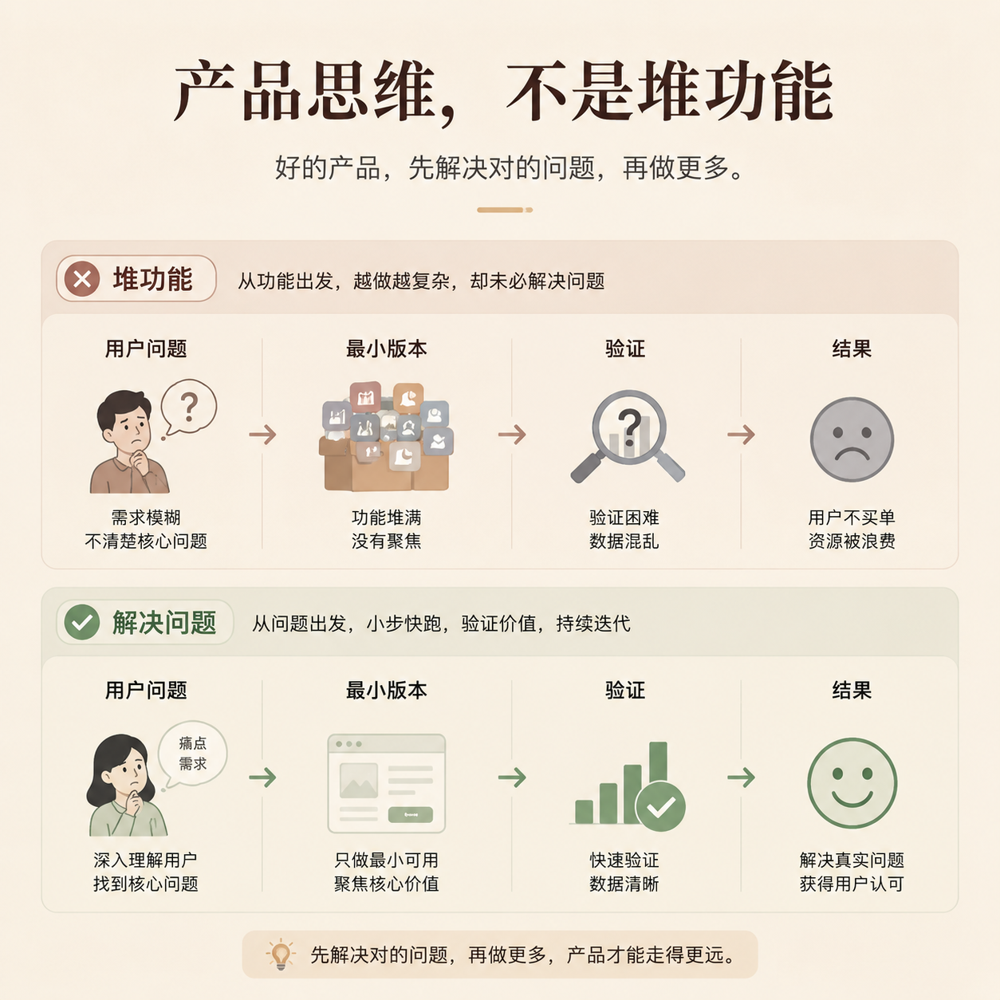

# 第 09 篇｜做产品不是堆功能：普通人也该懂的产品思维

> 系列：普通人也能做产品  
> 副标题：很多人不是败在不会做，而是从一开始就做错了方向。  
> 标签：产品思维 / 用户需求 / MVP / 入门认知  
> 难度：⭐ 入门认知  
> 阅读时长：约 10 分钟  
> 前置：建议先读 [第 03 篇](./03-一个产品从想法到上线-中间到底会发生什么.md)

---



## 这篇你会看懂什么？

看完这篇，你会明白：

1. 产品不是“想到什么就加什么”。
2. 产品思维到底在想什么问题。
3. 为什么很多人把“会做页面”误以为“会做产品”。
4. 普通人做产品时，最应该先想清楚的几个判断是什么。

---

## 先说结论

很多人第一次做产品时，脑子里最容易冒出的想法是：

- 再加一个功能
- 再做一个页面
- 再补一个模块

但真正的问题是：

> **你加的这些东西，到底在帮谁解决什么问题？**

如果这个问题没想清楚，
功能越多，不一定越好，
反而可能越做越重、越做越乱、越做越没人用。

所以产品思维最核心的一件事，不是“把东西做多”，而是：

> **把真正有价值的东西做对。**

---

## 先看一张图


```text
没有产品思维：
有想法 → 加功能 → 继续加功能 → 越做越重 → 没人真想用

有产品思维：
看见问题 → 判断值不值得做 → 先做最小版本 → 看反馈 → 再决定扩不扩
```

这就是两条完全不同的路。

---

## 1. 产品思维最先关心的，不是功能，而是问题

很多人一说“做产品”，马上就进入功能模式：

- 我要做登录
- 我要做评论
- 我要做会员
- 我要做支付
- 我要做后台

这些当然都可能重要，
但它们不是起点。

起点应该是：

- 谁在遇到什么问题？
- 这个问题痛不痛？
- 它值不值得被解决？
- 我打算拿什么方式去解决它？

功能只是手段，
问题才是起点。

如果起点错了，
后面再努力，
也只是把一个错误方向做得更完整。

---

## 2. 产品不是“我想做什么”，而是“别人为什么会需要”

这是一个很容易让人不舒服、但非常现实的判断。

很多人想做产品时，最自然的出发点是：

- 我想做这个
- 我觉得这个有意思
- 我喜欢这个方向

这些都没错，
但它们还不够。

因为产品最终不是拿来感动自己的，
而是拿来进入真实世界的。

所以你一定要加一个问题：

> **别人为什么会在乎这件事？**

比如你做一个预约页面，
你不能只问“我能不能做出来”，
你还要问：

- 用户为什么需要这个页面？
- 它比微信聊天更方便在哪里？
- 它能不能帮用户省时间、少出错、少沟通？

这才是真正的产品问题。

---

## 3. 为什么很多人会把“会做页面”误以为“会做产品”？

因为页面是能看见的，
而产品判断是看不见的。

你看到一个页面，会很容易评价：

- 好不好看
- 排版顺不顺
- 按钮大不大
- 样式漂不漂亮

但这些不等于产品判断。

产品判断更像这些问题：

- 这个页面该不该存在？
- 它服务的是哪一种用户？
- 这一步是不是多余？
- 这个流程会不会让人放弃？
- 这个功能现在做值不值？

所以：

> **页面是在表达产品，产品是在决定页面为什么存在。**

---

## 4. 什么叫“先做最小版本”？

普通人做产品时，最容易犯的一个错，就是还没验证方向，就先想做完整。

比如：

- 一上来就想做完整课程平台
- 一上来就想做完整管理系统
- 一上来就想把会员、支付、评论、消息全做齐

这通常会把自己拖死。

更好的方式是：

> **先做一个最小版本，只验证一个最关键的问题。**

比如：

- 先做一个表单，看有没有人愿意留信息
- 先做一个预约页，看有没有人愿意下单
- 先做一个小工具页，看有没有人真的会反复用

最小版本不是“简陋版梦想”，
而是：

> **最少的投入，验证最关键的假设。**

---

## 5. 普通人做产品，最先该想清楚哪几个问题？

如果只保留最关键的 4 个，我建议你先想这几个：

### 1）我到底在帮谁解决问题？

不是“所有人”，而是某一类非常具体的人。

### 2）这个问题真的值得解决吗？

是嘴上说说，还是现实里真的反复出现？

### 3）我能先做一个多小的版本？

不是越大越好，
而是越小越容易验证。

### 4）如果这个东西真的有人用，我下一步准备怎么办？

你至少要想清楚：

- 继续迭代
- 收费
- 推广
- 或者干脆停止

很多人失败不是因为不会，
而是因为从来没有认真回答过这四个问题。

---

## 6. 产品思维和普通人的关系到底是什么？

很多人听到“产品思维”会下意识觉得：

> “这个词是不是太职业化了？”

其实不是。

只要你想做一个：

- 网站
- 工具
- 服务
- 内容产品
- 课程
- 订阅产品

你都在面对产品问题。

因为你始终都要回答：

- 你在解决什么
- 为谁解决
- 怎么解决
- 为什么别人会愿意接受

所以产品思维不是某个岗位的专业黑话，
它本质上是：

> **把想法变成真正有价值结果的思考方式。**

---

## 本篇小结

- 产品不是功能堆砌，而是问题和结果的设计。
- 功能只是手段，问题才是起点。
- 会做页面，不等于会做产品；页面在表达产品，产品在决定页面为什么存在。
- 普通人做产品时，最重要的是先想清楚：为谁解决什么问题，以及能不能先做一个最小版本去验证。

---

## 小题

1. 为什么说“功能不是起点，问题才是起点”？
2. 你现在脑子里那个想做的东西，如果压成一个最小版本，它最少可以小到什么程度？
3. 如果一个页面很好看，但它解决的问题根本不成立，它还算一个好产品吗？为什么？

---

## 下一篇

继续看 [第 10 篇｜设计不是把页面做漂亮：它真正影响的是什么？](./10-设计不是把页面做漂亮-它真正影响的是什么.md)
