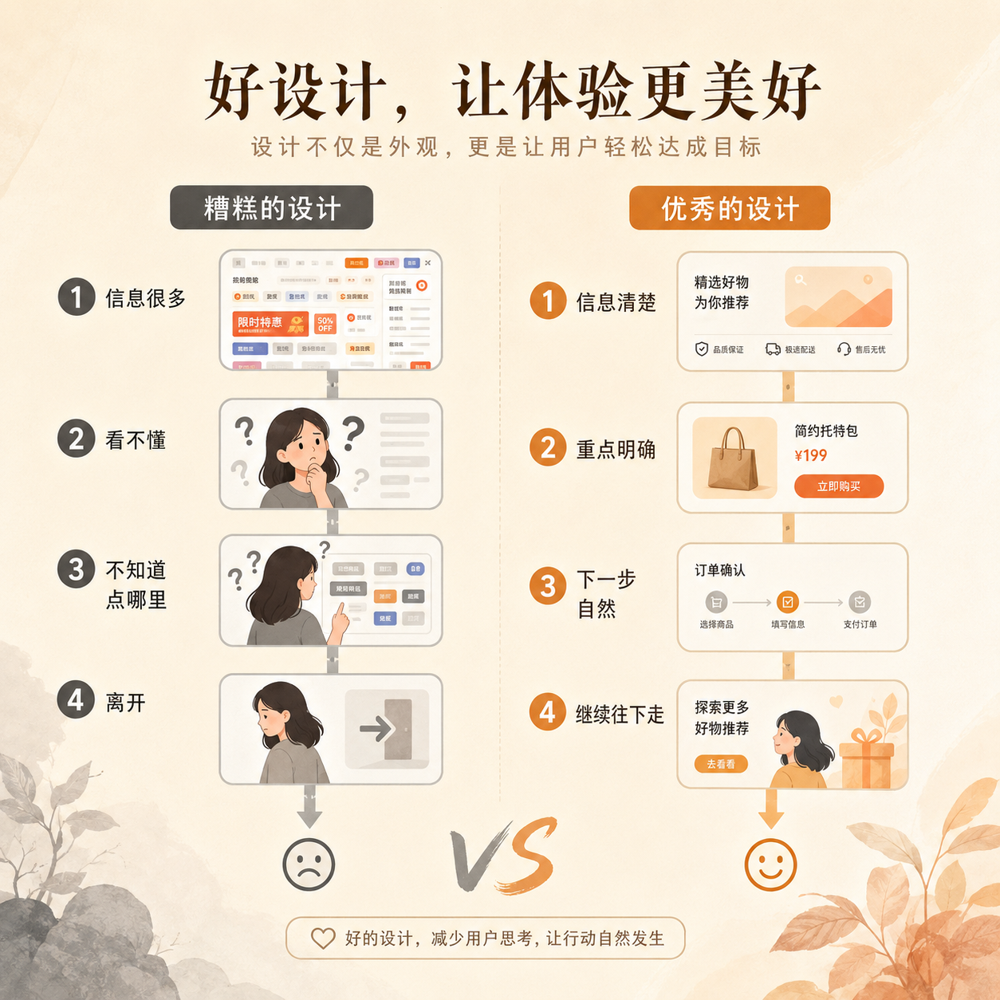

# 第 10 篇｜设计不是把页面做漂亮：它真正影响的是什么？

> 系列：普通人也能做产品  
> 副标题：好设计不只是“好看”，它会直接影响理解、行动和结果。  
> 标签：设计 / 页面体验 / 转化 / 入门认知  
> 难度：⭐ 入门认知  
> 阅读时长：约 9 分钟  
> 前置：建议先读 [第 09 篇](./09-做产品不是堆功能-普通人也该懂的产品思维.md)

---

> 配图建议：这里可以补一张本篇核心示意图，帮助读者先建立直观画面。

## 这篇你会看懂什么？

看完这篇，你会知道：

1. 设计为什么不只是“好不好看”。
2. 设计在产品里到底影响什么。
3. 为什么很多普通人低估了设计的重要性。
4. 你以后看页面时，应该先看什么，而不是先看配色。

---

## 先说结论

很多人一听“设计”，第一反应是：

- 好看
- 颜色
- 排版
- 风格

这些当然属于设计，
但不是设计的全部。

从产品角度看，设计真正影响的是：

- 用户能不能看懂
- 用户知不知道下一步该做什么
- 用户会不会愿意继续看下去
- 用户会不会在某一步停下来、迷路、离开

所以更准确的说法是：

> **设计不是给页面化妆，而是在安排用户怎样理解、怎样行动。**

---

## 先看一张图



```text
差的设计：
信息很多 → 用户看不懂 → 不知道点哪里 → 离开

好的设计：
信息清楚 → 重点明确 → 下一步自然 → 用户更容易继续往下走
```

这张图已经很接近设计在产品里的真实作用了。

---

## 1. 为什么说设计不只是“好不好看”？

因为用户进入一个页面后，最先遇到的不是审美问题，
而是理解问题。

他会本能地问：

- 这是什么？
- 这是给谁看的？
- 我下一步该做什么？
- 这个按钮值不值得点？

如果这些问题在 3 到 5 秒内没有被回答，
很多用户就已经流失了。

所以设计第一层在解决的是：

> **让用户快速看懂。**

而不是先让用户惊叹你用了什么颜色。

---

## 2. 设计到底在产品里影响什么？


我会把它拆成 4 个影响层面：

### 第一，影响理解

文字顺不顺、结构清不清楚、层级明不明确，
都决定了用户能不能快速理解页面。

### 第二，影响行动

按钮放哪里、先看什么、下一步去哪，
这些都会直接影响用户要不要继续往下点。

### 第三，影响体验

页面挤不挤、乱不乱、累不累，
会决定用户用得轻松还是烦躁。

### 第四，影响转化

很多时候用户不是不感兴趣，
而是页面让他太难做决定了。

所以设计和结果，其实离得比很多人想象中更近。

---

## 3. 为什么很多普通人会低估设计？

因为设计的很多问题，不像 Bug 那样会直接报错。

代码错了，你会看到：

- 页面打不开
- 按钮没反应
- 功能报错

但设计不好时，更多表现是：

- 用户看了就走
- 页面看完没动作
- 表单没人填
- 介绍写了很多，但没人理解

这些问题表面上不像“坏掉了”，
但它们会安静地吃掉结果。

所以很多人以为设计只是“锦上添花”，
其实很多时候它是：

> **结果有没有发生的关键因素。**

---

## 4. 普通人看页面时，先看什么最有价值？

不是先看颜色，
也不是先看动画。

而是先看下面这 4 件事：

### 1）第一眼能不能看懂这页面在说什么

### 2）重点有没有被突出出来

### 3）下一步动作是不是很自然

### 4）信息是不是在逼用户做不必要的理解劳动

如果这四件事做得差，
再漂亮的视觉，
也很难真的把结果做出来。

所以以后你看页面，
可以先问：

> **这个页面是在帮助我理解，还是在增加我的负担？**

---

## 5. 普通人要不要先学设计？

要，但不是先学复杂设计软件。

你更应该先学的是：

- 信息怎么排
- 重点怎么突出
- 页面怎么减少理解成本
- 一个按钮为什么放在这里而不是那里

也就是说，
你先学的不是“做出大师级视觉”，
而是：

> **怎样让页面更清楚、更顺、更容易被使用。**

这对普通人来说，反而更重要。

---

## 本篇小结

- 设计不只是“让页面好看”，它真正影响的是理解、行动、体验和转化。
- 用户进入页面后，先遇到的是“看不看得懂”的问题，而不是“美不美”的问题。
- 很多设计问题不会像 Bug 一样报错，但会安静地吃掉结果。
- 普通人最该先学的设计，不是复杂视觉，而是怎么减少用户理解成本。

---

## 小题

1. 为什么说“设计不是给页面化妆，而是在安排用户怎样理解和行动”？
2. 一个页面如果很漂亮，但用户看完不知道下一步做什么，它的问题更可能出在哪？
3. 你最近见过的一个页面，第一眼最让你舒服的地方是什么？最让你困惑的地方又是什么？

---

## 下一篇

继续看 [第 11 篇｜开发、上线、推广、迭代：产品做出来后才真正开始](./11-开发上线推广迭代-产品做出来后才真正开始.md)
