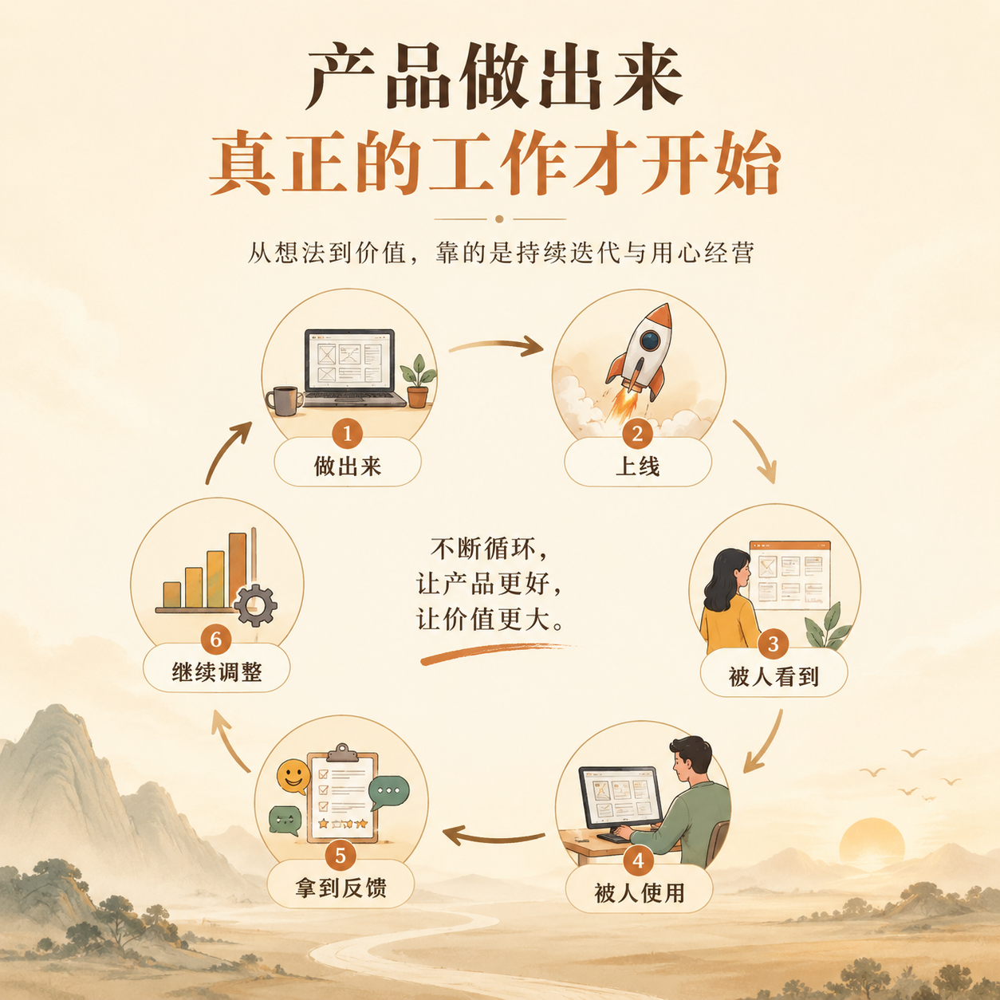
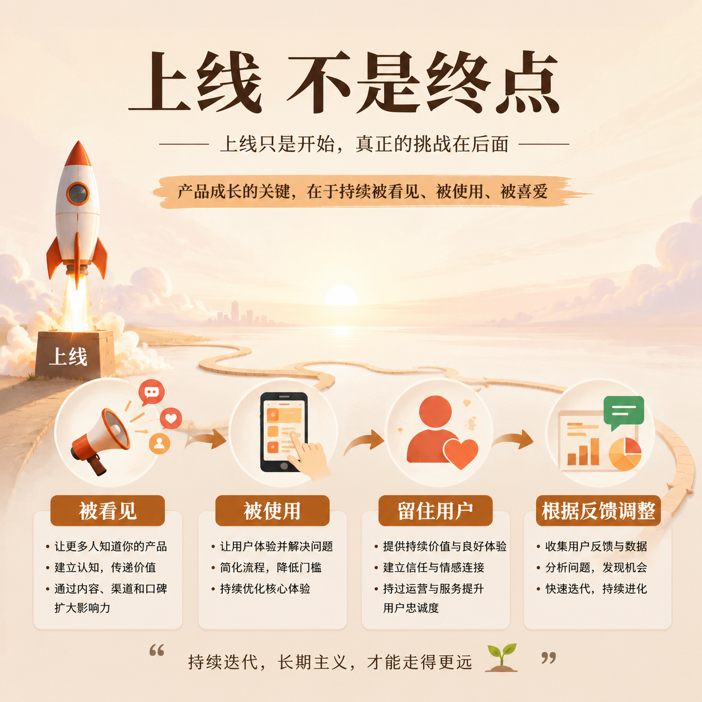

# 第 11 篇｜开发、上线、推广、迭代：产品做出来后才真正开始

> 系列：普通人也能做产品  
> 副标题：很多人以为上线就是终点，其实真正的难题往往从那一刻才开始。  
> 标签：开发 / 上线 / 推广 / 迭代 / 入门认知  
> 难度：⭐ 入门认知  
> 阅读时长：约 10 分钟  
> 前置：建议先读 [第 03 篇](./03-一个产品从想法到上线-中间到底会发生什么.md)

---


## 这篇你会看懂什么？

看完这篇，你会知道：

1. 开发到底在解决什么。
2. 上线为什么不只是“点一下发布”。
3. 推广为什么决定有没有人知道你的产品。
4. 迭代为什么比“做完”更重要。

---

## 先说结论

很多人对产品的想象，会停在“做出来”。

但现实是：

> **做出来，只是把产品从脑子里搬到了现实里。**

它后面还有很多真正决定结果的环节：

- 它能不能稳定运行
- 别人能不能访问到
- 有没有人知道它
- 用过的人会不会留下来
- 你会不会根据反馈继续改

所以真正完整的视角应该是：

> **开发让它能用，上线让它能被访问，推广让它能被看见，迭代让它能继续活下去。**

---

## 先看一张图



```text
想法
  ↓
做出来
  ↓
上线
  ↓
被人看到
  ↓
被人使用
  ↓
拿到反馈
  ↓
继续调整
```

你会发现，
“做出来”甚至只在中间。

---

## 1. 开发到底在解决什么？

很多人会把开发理解成“写代码”。

这当然没错，
但它太窄了。

从结果角度看，开发真正解决的是：

> **怎样把一个想法变成一个真的能运行、能响应、能完成任务的东西。**

比如：

- 按钮点下去真的有反应
- 用户填的信息真的会被保存
- 登录真的能成功
- 页面真的能正常打开

所以开发不是为了显得专业，
而是在处理“从想法到可运行结果”的那条路。

---

## 2. 上线到底在解决什么？

上线不是把文件往某个平台一丢就完事。

上线真正解决的是：

> **怎样让别人也能访问和使用你的产品。**

这通常意味着：

- 它不只在你电脑里能打开
- 它有一个可访问的网址
- 它在外部环境里也能运行
- 别人访问时不会立刻出问题

所以你可以把上线理解成：

> **从“我自己能看见”，变成“别人也能用到”。**

这是一个非常重要的分界线。

---

## 3. 推广到底在解决什么？

很多人一做完东西就会陷入一个现实打击：

> “为什么我明明做出来了，却没人来？”

因为“做出来”不等于“被看到”。

推广在解决的是：

- 正确的人怎么知道你
- 他们为什么愿意点进来
- 他们为什么愿意停下来

这不一定一开始就意味着投广告。

推广也可以是：

- 内容分发
- 社交传播
- 朋友转介绍
- 搜索入口
- 社群触达

所以推广不是可有可无的后话，
而是产品能不能进入真实世界的重要环节。

---

## 4. 迭代到底在解决什么？

迭代不是不停加功能。

这一点很关键。

迭代真正解决的是：

> **根据真实反馈，让产品越来越贴近真实需求。**

比如：

- 哪一步太麻烦了
- 哪一句话没人看懂
- 哪个功能根本没人用
- 哪个页面流失率特别高
- 哪个地方本来以为重要，结果其实不重要

如果你不迭代，
你做出来的东西就会停在“你以为它应该长这样”的状态。

但产品真正需要的是：

> **它最后长成“现实里最有用”的样子。**

---

## 5. 为什么很多产品死在“上线之后”？



因为上线之后，第一次进入真实世界。

这时你会真正撞上：

- 用户不理解
- 体验不顺
- 没人知道
- 有人来了但没留下
- 你原本的判断被现实打脸

也正因为这样，
上线之后往往不是庆祝结束，
而是：

> **第一次真正开始学习这个产品到底是什么。**

很多人之所以走不下去，
不是因为不会开发，
而是因为不愿意面对这个阶段的真实反馈。

---

## 6. 普通人最应该建立的正确预期是什么？

不是：

- 我做完这一版就好了
- 我上线就有人用
- 我发一篇内容就会爆

而是：

- 我先做出一个版本
- 我让它进入真实世界
- 我观察真实反馈
- 我再不断修正

所以最稳的预期是：

> **产品不是一锤子买卖，而是一轮一轮被打磨出来的。**

---

## 本篇小结

- 开发在解决“怎么让想法变成可运行结果”。
- 上线在解决“怎么让别人也能访问和使用”。
- 推广在解决“怎么让正确的人知道你”。
- 迭代在解决“怎么让产品越来越贴近真实需求”。
- 很多产品真正的挑战，不是在做之前，而是在上线之后。

---

## 小题

1. 为什么说“上线不是终点，而是第一次真正开始”？
2. 推广和迭代，分别在解决什么问题？
3. 如果一个产品上线后没人用，你觉得最先该检查的是：推广问题、理解问题，还是需求问题？为什么？

---

## 下一篇

继续看 [第 12 篇｜完全不懂技术的人，第一步到底该怎么走？](./12-完全不懂技术的人-第一步到底该怎么走.md)
