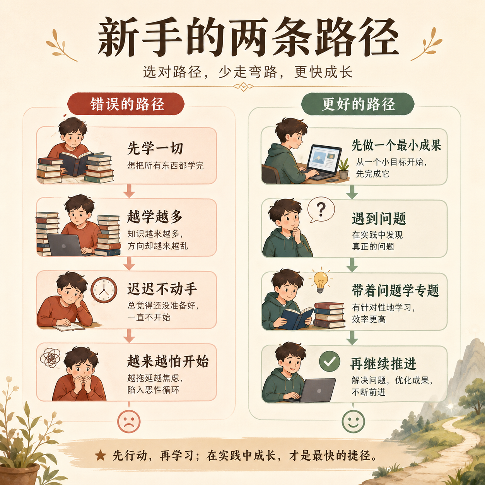
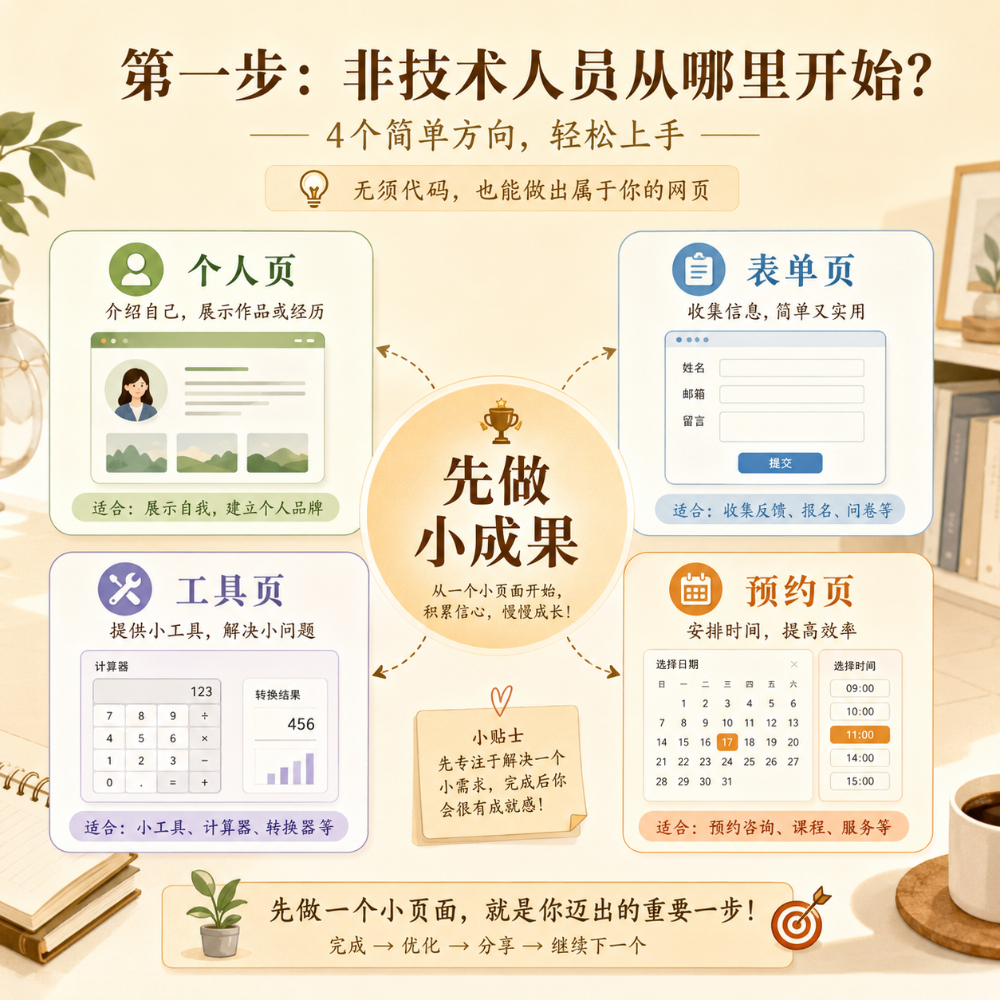

# 第 12 篇｜完全不懂技术的人，第一步到底该怎么走？

> 系列：普通人也能做产品  
> 副标题：不用把所有知识学完再开始，先做出一个最小成果，才是真正的起点。  
> 标签：行动路径 / 非技术入门 / 第一项目 / 超级个体  
> 难度：⭐ 入门认知  
> 阅读时长：约 10 分钟  
> 前置：建议先完整看完本系列前 11 篇

---


## 这篇你会看懂什么？

看完这篇，你会得到一个真正可以落地的行动出口：

1. 如果你完全不懂技术，第一步不该做什么。
2. 第一阶段最适合先做什么。
3. 第一个成果为什么一定要足够小。
4. 你接下来应该怎样把“看懂概念”变成“开始动手”。

---

## 先说结论

如果你现在完全不懂技术，最重要的一句建议是：

> **不要先把所有知识学完，再开始。**

因为你很可能永远也学不完，
而且在没有真实问题和真实项目时，
很多知识你学了也留不住。

更好的路径是：

> **先做一个非常小、但真的有结果的东西。**

这个小结果，会成为你后面理解一切概念的落点。

---

## 先看一张图



```text
错误路径：
先学一切 → 越学越多 → 迟迟不动手 → 越来越怕开始

更好的路径：
先做一个最小成果
  ↓
遇到问题
  ↓
带着问题去学专题
  ↓
再继续推进
```

这几乎是普通人最省力、也最不容易放弃的方式。

---

## 1. 第一阶段最不该做的事是什么？

### 第一，不要一上来就做大而全的平台

比如：

- 想做一套完整课程系统
- 想做一个多角色管理后台
- 想做一个大而全的综合平台

这对初学者来说太重了。

### 第二，不要先沉迷学工具清单

你会很容易掉进：

- 这个工具也想学
- 那个平台也想研究
- 又看到一个新概念
- 最后一直在看，但没有结果

### 第三，不要把“看懂”误以为“会做”

你读懂了 20 篇文章，不等于你已经能推进一个项目。

真正让你开始成长的，还是：

> **把某个很小的东西真的做出来。**

---

## 2. 第一阶段最适合做什么？

我更建议你先做下面这些“足够小、足够真实”的成果：



### 1）一个个人介绍页

适合：

- 想先理解页面、结构、文案的人

### 2）一个收集信息的表单页

适合：

- 想测试有没有人愿意留下信息
- 想理解产品最小验证的人

### 3）一个简单工具页

适合：

- 有明确小问题想解决的人
- 想体验“一个功能真的跑起来”是什么感觉的人

### 4）一个预约或报名页

适合：

- 有服务、有课程、有咨询的人
- 想先把“有人来、有人留信息”这条线跑通的人

这些成果的共同点是：

- 规模小
- 反馈快
- 容易完成
- 容易看到结果

这对新手特别重要。

---

## 3. 为什么第一个成果一定要小？

因为你现在最缺的，不是野心，
而是：

- 完整跑通一次的经验
- 面对真实问题时的判断
- 把一个东西从想法推进到结果的信心

如果第一个成果太大，
你会很容易在中途撞上：

- 信息过载
- 判断困难
- 进度过慢
- 挫败感太强

而一个小成果，能带给你的往往是：

> **第一次“我真的做出来了”的体验。**

这非常重要。

因为它会改变你后面对所有技术词和项目流程的心理感受。

---

## 4. 那具体应该怎么开始？

如果你现在就要开始，我建议你按下面这条路径走：

### 第一步：挑一个非常具体的问题

不要说“我想做个产品”。

要说得更具体，比如：

- 我想做一个收预约信息的页面
- 我想做一个展示课程的页面
- 我想做一个帮自己整理内容的小工具

### 第二步：把它压成最小版本

问自己：

- 最少保留什么，它还算成立？

### 第三步：借助 AI 先出第一版

你现在不需要自己从空白开始写所有东西。

你可以让 AI：

- 帮你列页面结构
- 帮你写第一版文案
- 帮你把需求拆成步骤

### 第四步：遇到具体问题，再去看专题

比如你卡在：

- GitHub 注册
- 建仓库
- 部署
- 邮件发送

这时就回到专题文章，一篇篇解决。

也就是说：

> **系列帮你看懂方向，专题帮你解决卡点。**

---

## 5. 你什么时候算真的“开始了”？

不是当你看完了 100 篇文章，
也不是当你收藏了 50 个工具。

而是当你第一次完成了下面这件事：

> **把一个模糊想法，推进成一个别人真的能看到、能点、能用、能反馈的东西。**

哪怕它很小，
哪怕它不完美，
哪怕它只是一个最小页面。

只要这一步发生了，
你就已经不是只停留在“想做”的阶段了。

---

## 本篇小结

- 完全不懂技术的人，最不该做的是先把所有知识学完再开始。
- 第一阶段最适合做的，是一个足够小、但真的有结果的成果。
- 第一个成果越小，你越容易真正跑通一次完整链路。
- 系列文章帮你建立认知，专题文章帮你解决卡点，真正的成长来自你把一个小结果做出来。

---

## 小题

1. 为什么说“先学完再开始”对很多普通人反而是一条危险路线？
2. 如果你现在只能选一个最小成果开始，你会选：个人页、表单页、工具页，还是预约页？为什么？
3. 你觉得自己现在最大的障碍，是不会技术、不会判断，还是迟迟不肯开始？

---

## 系列总结

到这里，这套《普通人也能做产品》系列就告一段落了。

如果你完整看完，你应该已经：

- 能听懂很多以前陌生的技术词
- 知道一个产品从想法到上线，大概会经过什么
- 理解 AI 在这件事里的真实位置
- 知道自己下一步不该再停留在“继续收藏”，而是应该开始做一个小结果

一句话总结整套系列：

> **不是先变成工程师，才能开始做产品；而是先看懂整张地图，再借助 AI 和工具迈出第一步。**

---

## 下一步建议

1. 回到 `article/专题/`，挑一篇你现在最需要的实操文开始做。
2. 如果你已经有一个明确的小目标，直接开始做你的第一个最小成果。
