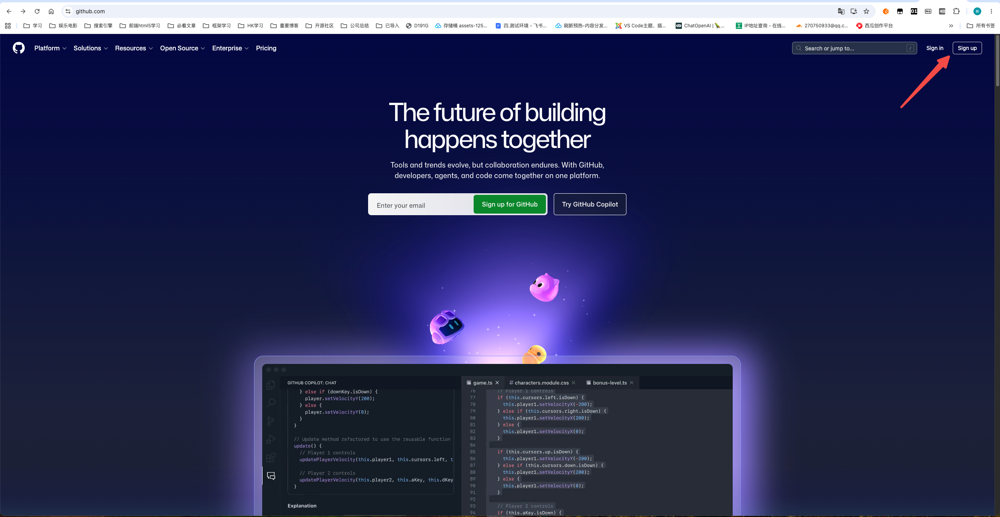
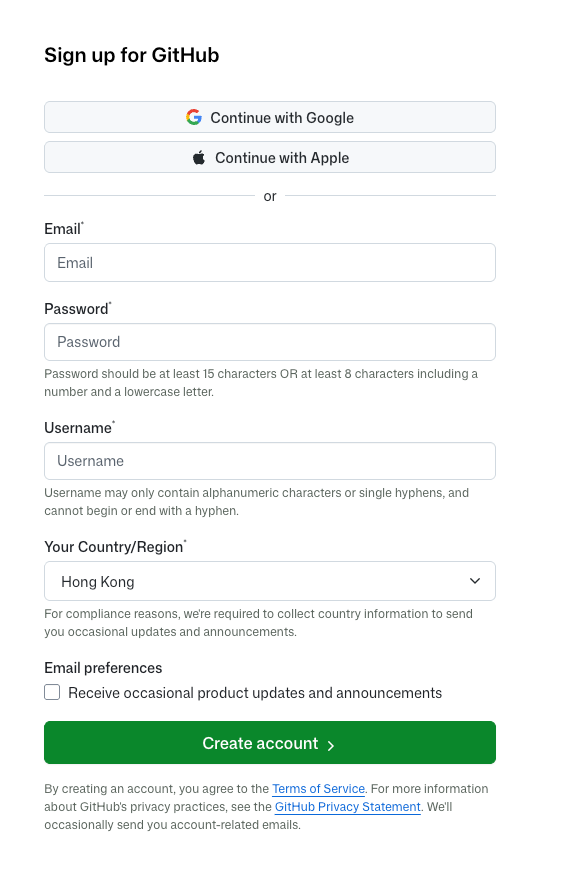
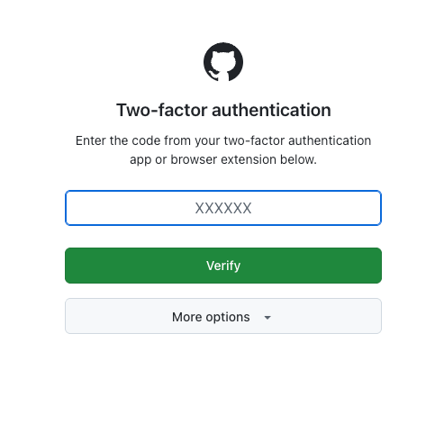
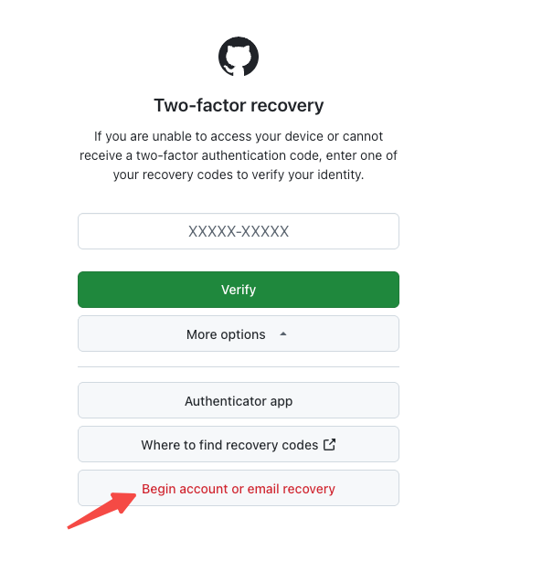
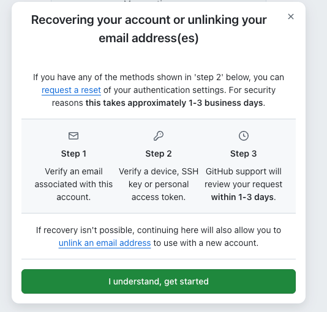
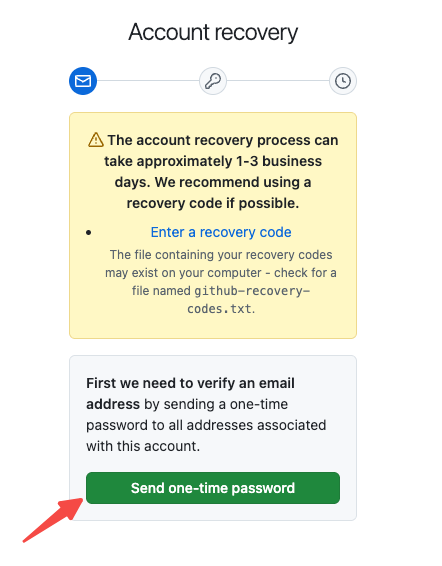
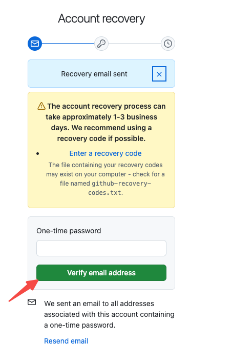
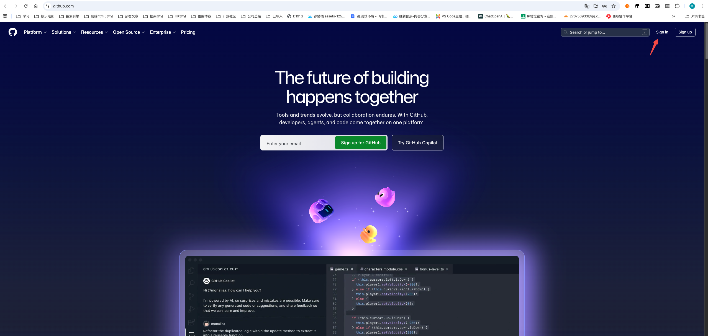
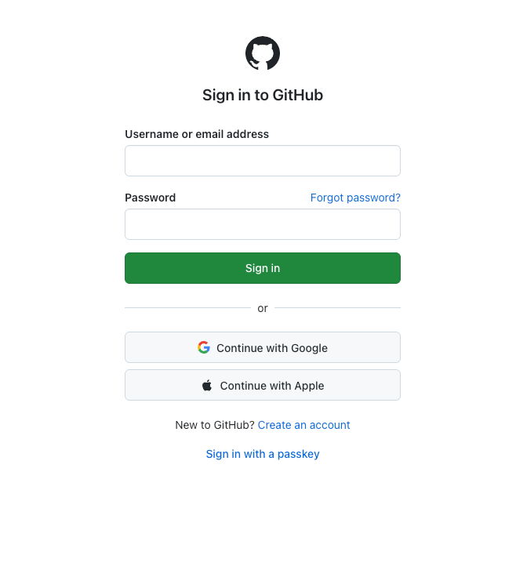
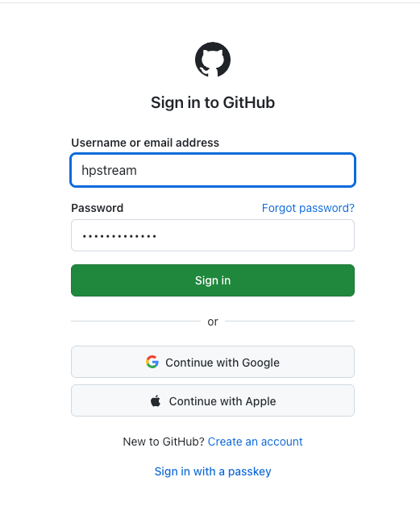

# 第 01 篇｜如何注册 GitHub

> 系列：专题实操  
> 副标题：第一次接触 GitHub，也能跟着截图一步一步完成注册，并知道后面怎么登录。  
> 标签：GitHub / 注册 / 登录 / 小白专用  
> 难度：⭐ 入门实操  
> 阅读时长：约 10 分钟  
> 前置：准备一个可以正常收邮件的邮箱

---

## 这篇文章你会完成什么？

看完这篇，你会完成 4 件事：

1. 打开 GitHub 官网并进入注册流程
2. 完成 GitHub 账号注册
3. 完成邮箱验证
4. 学会以后怎么重新登录 GitHub

如果你以前完全没接触过 GitHub，也没关系。
这篇就是写给第一次上手的人看的，你照着做就行。

---

## 先说清楚：GitHub 是干什么的？

你后面学：

- 建项目
- 保存代码
- 上传网站源码
- 接 Vercel 自动部署
- 和 AI 一起改代码

这些事情，几乎都离不开 GitHub。

你现在先不用把它想复杂。

你只要先记住一句话：

> **GitHub 就是一个专门放项目代码的地方。**

所以这一步不是可有可无，而是你后面所有操作的起点。

---

## 第 1 步：打开 GitHub 官网，并点击 Sign up

先打开 GitHub 官网：

```text
https://github.com
```

进入官网后，找到页面右上角的 **Sign up**，点进去开始注册。



操作：

1. 打开 `https://github.com`
2. 找到页面右上角的 **Sign up**
3. 点进去开始注册

如果你看到的是登录页，也没关系，继续找「Sign up」入口就行。

---

## 第 2 步：开始注册，先填写基础信息

进入注册页后，GitHub 会按顺序让你填写一些基础信息，通常包括：

- 邮箱
- 密码
- 用户名

你不用死记每一页长什么样，只要记住：

> **GitHub 页面让你填什么，你就填什么；填完就继续下一步。**

下面这张图就是注册流程里你会看到的页面类型：



### 1）邮箱怎么填？

建议你直接用：

- 你平时常用的邮箱
- 能正常收验证码和通知的邮箱
- 后面你不容易忘掉的邮箱

不建议：

- 临时邮箱
- 不常登录的备用邮箱
- 以后你自己都记不住密码的邮箱

因为后面 GitHub 会给你发验证邮件。

### 2）密码怎么设置比较稳？

建议：

- 至少 12 位
- 有大小写字母
- 最好再加数字
- 不要用太简单的密码，比如 `123456`、`password`

如果你担心忘记，直接记到密码管理器里。

### 3）用户名怎么取？

这一步很重要，因为：

> 你后面的 GitHub 主页地址、仓库地址，都会带这个用户名。

例如：

```text
https://github.com/你的用户名
```

用户名建议：

- 尽量简单
- 尽量好记
- 尽量用你长期愿意保留的名字

比如：

- `huangpeng`
- `peng-dev`
- `superpeng`

不建议：

- 一堆自己都看不懂的数字
- 以后你自己会嫌弃的网名
- 特别长、特别难打的名字

如果 GitHub 提示用户名不可用，就换一个，直到通过为止。

---

## 第 3 步：按页面提示继续，完成中间确认

注册过程中，GitHub 有时会再问你一些确认项，比如：

- 是否接收产品更新邮件
- 是否继续下一步
- 一些简单的确认选择

这类页面你按页面提示继续就行，不用紧张。



这里你只需要记住一个原则：

> **页面让你继续，你就继续；页面让你确认，你就确认。**

不要试图一次看懂所有英文，先把流程走通更重要。

---

## 第 4 步：完成人机验证

GitHub 会让你完成一次人机验证，确认你不是机器人。



有时候这一步会是：

- 拖动滑块
- 看图点击
- 简单拼图

如果一次不过，重新来一遍就行。

### 如果一直过不了怎么办？

先试这几个办法：

1. 刷新页面重新来一次
2. 换浏览器
3. 关闭翻译插件
4. 如果开了代理，换个网络再试

---

## 第 5 步：去邮箱里完成验证

注册过程中最关键的一步，就是**邮箱验证**。

GitHub 会给你发一封邮件，或者让你输入邮箱验证码。







操作：

1. 打开你刚才注册时用的邮箱
2. 找到 GitHub 发来的邮件
3. 点开邮件
4. 按提示完成验证（点链接或输入验证码）

### 收不到邮件怎么办？

按这个顺序查：

1. 去垃圾邮件 / 广告邮件里找一下
2. 确认你邮箱有没有填错
3. 多等 1~2 分钟
4. 回 GitHub 页面点 **Resend** 重新发送

如果还是收不到，最省时间的办法通常是：

> 换一个你更稳定、更常用的邮箱重新注册。

---

## 第 6 步：注册完成后，怎么登录 GitHub？

这一步是你刚才指出来最关键的问题：

> 注册不是结束，后面你还得会登录。

这 3 张图，讲的就是后面你再次进入 GitHub 时，大概率会看到的登录流程页面。







### 以后重新登录 GitHub，怎么做？

1. 打开 `https://github.com`
2. 点击右上角 **Sign in**
3. 输入你注册时用的 **邮箱 / 用户名**
4. 输入你刚才设置的密码
5. 如果 GitHub 要你做验证码或邮件确认，就按提示继续

你不用去背每一张登录页长什么样。
你只要记住：

> **登录 GitHub，本质上就是：账号（邮箱或用户名）+ 密码。**

如果你已经注册成功，但第二天不知道怎么再进来，就按上面这 5 步做。

---

## 第 7 步：注册完成后，你会看到什么？

邮箱验证完成、并且成功登录之后，你就会进入 GitHub 的首页（已登录状态）。

如果你能正常做到下面这两点，就说明 GitHub 账号已经能用了：

- 右上角能看到你的头像（哪怕只是默认头像）
- 进入 `https://github.com/你的用户名`，能看到你自己的主页

不需要看到任何复杂界面，只要你能登录、能看到自己头像，就算 OK。

> 注意：注册完成后，GitHub **不会**直接弹一个写着"恭喜注册成功"的页面，
> 所以你**只要能登录进去**，就已经算注册成功了。

---

## 注册完成后，建议你顺手做这 3 件事

### 1. 记住你的用户名

后面你经常会用到：

```text
https://github.com/你的用户名
```

所以别注册完就忘了自己叫什么。

### 2. 确认邮箱没问题

以后 GitHub 的通知、验证、安全提醒，都会发到这个邮箱。
所以你最好确认一下：

- 邮箱填的是对的
- 你真的能正常收信

### 3. 继续做下一步：创建第一个仓库

你注册 GitHub，不是为了只有一个账号躺在那里。
下一步最自然的动作就是：

> **创建你的第一个仓库。**

下一篇就该接这个：

- [从 0 开始建立一个仓库](./02-从0开始建立一个仓库.md)

这里不展开，直接去下一篇继续做就行。

---

## 小结

这篇你实际完成了 5 件事：

1. 打开 GitHub 官网
2. 开始注册账号
3. 完成基础信息填写、人机验证、邮箱验证
4. 明白以后怎么重新登录 GitHub
5. 拿到一个真正可用的 GitHub 账号

只要你现在能正常登录 GitHub，这一步就算完成了。

---

## 练习题（附答案）

### 1. GitHub 注册时，用户名为什么不能随便乱取？

**答案：**
因为后面 GitHub 主页地址、仓库地址都会带这个用户名。如果名字太随便、太难记、太难看，以后你会一直用着不舒服。

### 2. 如果收不到 GitHub 的验证邮件，应该先检查什么？

**答案：**
先看垃圾邮件 / 广告邮件，再确认邮箱有没有填错，然后点 Resend 重新发送。

### 3. 以后如果你关掉页面，第二天还想再进入 GitHub，应该怎么做？

**答案：**
打开 GitHub 官网，点 Sign in，然后输入你注册时的邮箱或用户名，再输入密码登录。
