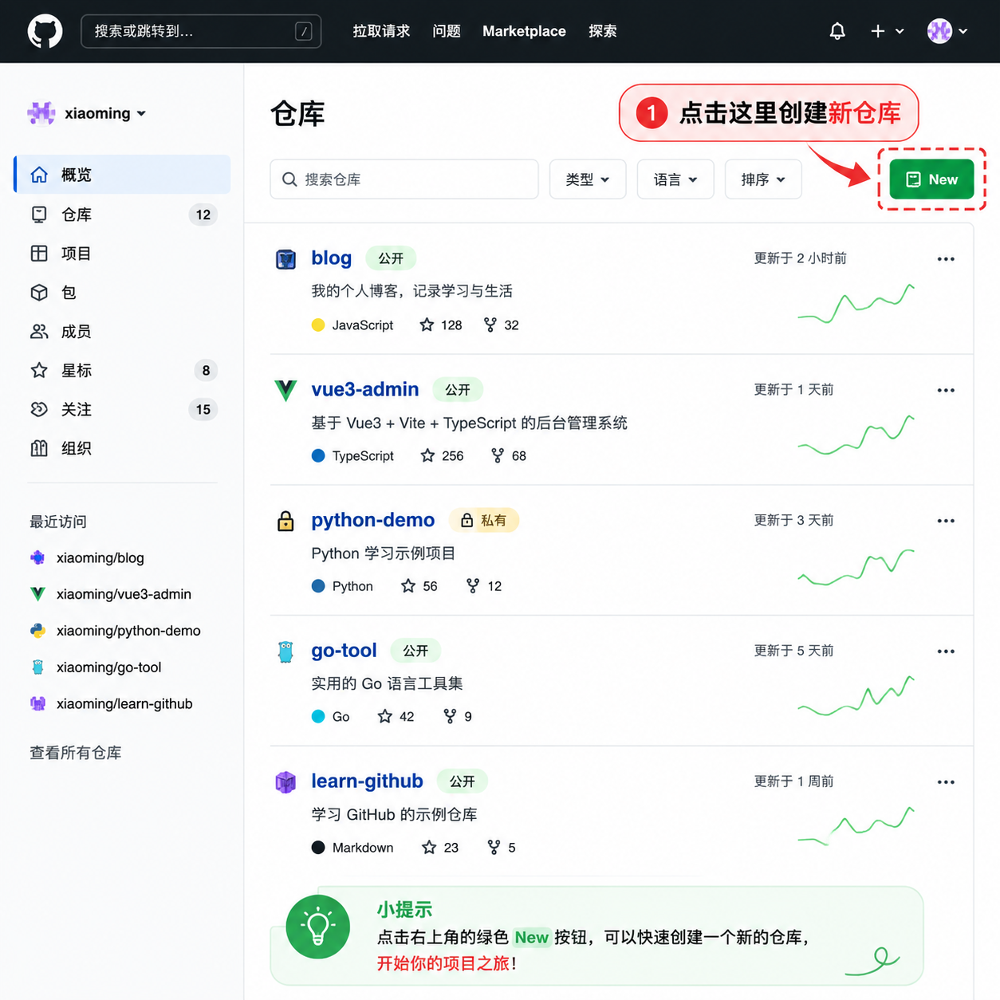
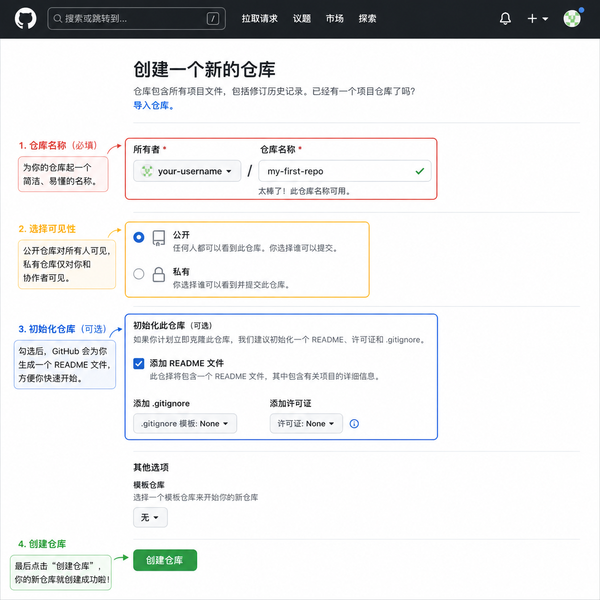
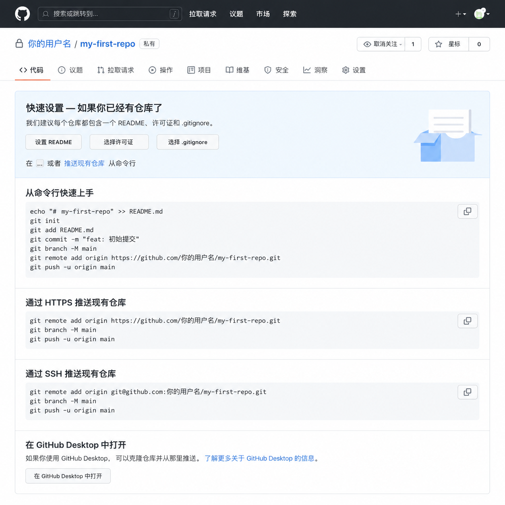

# 第 02 篇｜从 0 开始建立一个 GitHub 仓库

> 系列：专题实操
> 副标题：第一次建仓库，跟着 3 张截图把它真正建出来。
> 标签：GitHub / 仓库 / 小白专用
> 难度：⭐ 入门实操
> 阅读时长：约 8 分钟
> 前置：已经注册并能正常登录 GitHub（不会的话先看 [第 01 篇 如何注册 GitHub](./01-如何注册-github.md)）

---

## 这篇文章你会完成什么？

看完这篇，你会完成 3 件事：

1. 知道仓库是什么、为什么项目要先有仓库
2. 在自己的 GitHub 账号下，创建出一个新仓库
3. 看懂创建完之后那个页面在告诉你什么

如果你只是想先“拥有一个自己的仓库”，照着第 1～3 步做完就行，命令行那段先不用碰。

---

## 仓库是什么？

你可以把它简单理解成：

> **一个专门用来放某个项目所有文件的文件夹。**

但它不是普通文件夹，它会帮你做两件别的事：

- 自动记录每次改动（谁、什么时候、改了什么）
- 在网页上能直接打开看，也能分享给别人

后面你写代码、上传项目、接 Vercel 部署，**几乎所有操作都是围绕仓库进行的**。所以这一步是后面所有事情的起点。

---

## 第 1 步：进入「新建仓库」的入口

登录 GitHub 后，先打开你自己的主页：

```text
https://github.com/你的用户名
```

或者点页面右上角头像 → **Your repositories**，进入仓库列表页。

页面会长这样：



注意右上角那颗绿色的 **New** 按钮。这就是“新建仓库”的入口。

操作：

1. 进入自己的 `Repositories` 列表页
2. 点右上角绿色的 **New** 按钮

如果你只是想新建仓库，不想找入口，也可以直接在浏览器地址栏输：

```text
https://github.com/new
```

效果是一样的。

---

## 第 2 步：填写新仓库的信息

点 **New** 之后，会进入新建仓库的表单页 `github.com/new`：



这个页面虽然字多，但你**真正需要决定的就 5 项**：

### 1）Owner（仓库归属）

默认就是你自己的用户名，不用改。

> 只有你加入了组织 / 团队，才会有别的选项可以选。

### 2）Repository name（仓库名）

GitHub 会帮你判断名字能不能用：

- 绿色提示 `xxx is available` = 可以用
- 红色提示 = 重复了或者格式不对，换一个

命名建议：

- 全小写
- 用 `-` 连接，比如 `my-blog`、`hello-vercel`
- 短一点、好记

不建议：

- 中文（GitHub 支持，但很多工具链路上不方便）
- 一堆数字 / 随手乱起的名字

### 3）Description（描述，可选）

写一句话告诉别人这个仓库是干嘛的。例如：

```text
我的第一个测试仓库
```

不写也不影响创建。

### 4）Choose visibility（可见性）

两个选项：

- **Public**：所有人都能看到，但只有你能改
- **Private**：只有你（或你拉进来的人）能看到

新手刚开始建着玩，选 **Public** 就行。等你后面有不能公开的项目时再用 **Private**。

### 5）Add README / Add .gitignore / Add license（要不要勾）

刚开始最常用的建议是：

- **Add README**：**打开**。这样仓库一建好就有一个首页（README 是仓库的“说明书”）。
- **Add .gitignore**：选 `No .gitignore` 也可以，以后再补。
- **Add license**：选 `No license` 也可以，自己学习用的小仓库不用纠结许可证。

如果你刚开始什么都不懂，**就只开 README 那一个**，其他保持默认就行。

### 最后点 Create repository

填好后，点页面右下角的绿色按钮 **Create repository**，仓库就建好了。

---

## 第 3 步：仓库建好后，你会看到什么？

创建成功后，你会进入这个仓库的主页，地址类似：

```text
https://github.com/你的用户名/demo
```

页面会长这样：



你能在这个页面看到这些东西：

- 顶部是 **用户名 / 仓库名**，旁边写着 `Public` 或 `Private`
- 中间一块 **Quick setup**，里面有：
  - 仓库地址（HTTPS / SSH 两种）
  - 一段“创建一个新仓库”的命令
  - 一段“把已有项目推到这里”的命令
- 上面一行还会有 `Code`、`Issues`、`Pull requests`、`Settings` 这种标签

只要你能看到这个页面，就说明：

> **你的第一个仓库已经成功建出来了。**

那段命令行你**这一步先不用动**。后面我们专门有一篇讲“怎么把代码推到这个仓库里”的文章，到时候你跟着做就行。

---

## 这几个常见纠结，先回答你

### Q1. 建错了能删吗？

能。
进入仓库 → 顶部 **Settings** → 拉到最底下 **Danger Zone** → **Delete this repository**。
GitHub 会让你输入仓库名确认，避免误删。

### Q2. 一开始勾 README 是不是必须的？

不是必须，但**强烈建议**。
原因：

- 仓库一建好就有一个首页
- 你后面写命令把项目推上去时，更不容易遇到冲突

### Q3. Public 和 Private 后面能改吗？

能改。
进入仓库 → **Settings** → **General** → 找 `Change repository visibility`。
所以先选 Public 也没什么风险。

---

## 小结

这篇你实际完成了 3 件事：

1. 进入了 GitHub 新建仓库的入口
2. 在 `github.com/new` 创建了一个属于自己的新仓库
3. 看到了仓库主页，明白它在告诉你什么

你的 GitHub 账号下，现在已经多了一个真正属于你的仓库。

---

## 下一步去哪？

仓库已经有了，下一步最自然的动作就是：

> **往这个仓库里放东西（代码、文件、项目）。**

这部分我们在后面的实操篇里会单独讲，到时候直接接着做就行。

---

## 练习题（附答案）

### 1. 为什么很多情况下建议一开始就勾上 “Add README”？

**答案：**
因为 README 会自动成为仓库首页，仓库一建出来就有了基本内容，后面你把项目代码推上来时更不容易出冲突。

### 2. Repository name 写中文行不行？

**答案：**
GitHub 允许，但**不建议**。原因是后面用命令行操作、对接 Vercel 等工具时，中文路径容易踩坑。
推荐：全小写英文 + `-` 连接，例如 `my-blog`。

### 3. Public 和 Private 应该怎么选？

**答案：**
新手练习、想公开展示，选 **Public**；不想给别人看，选 **Private**。
而且这个选项**以后还能在 Settings 里改**，所以一开始不用太纠结。
