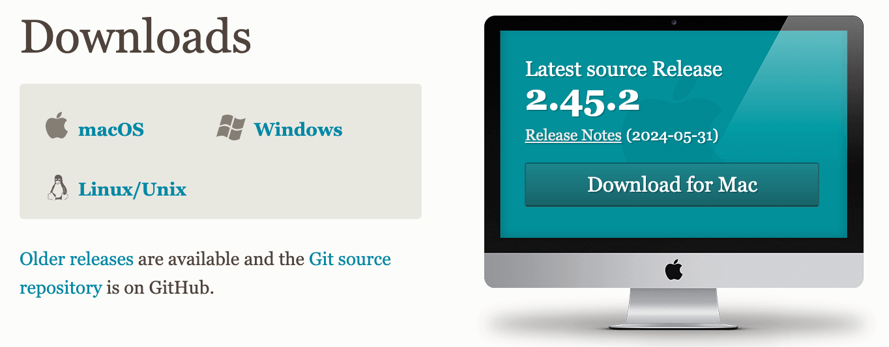
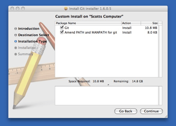
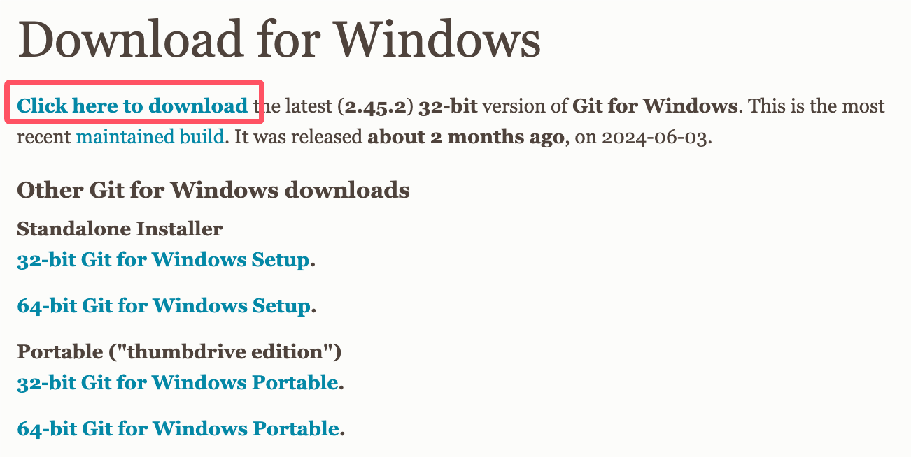

# 第 03 篇｜如何安装 Git（Mac 主线 + Windows 对照）

> 系列：专题实操
> 副标题：跟着官网把 Git 装到电脑上，并确认它真的能用。
> 标签：Git / 安装 / 小白专用 / Mac
> 难度：⭐ 入门实操
> 阅读时长：约 8 分钟
> 前置：已经会用 GitHub（不会的话先看 [第 01 篇 如何注册 GitHub](./01-如何注册-github.md)）

---

## 这篇文章你会完成什么？

看完这篇，你会完成 3 件事：

1. 在自己的 Mac 上把 Git 装好
2. 在终端里用一行命令确认 Git 真的装上了
3. 顺手做完“第一次用 Git”要配的两条基础配置

> 这一篇只解决一件事：**把 Git 装到电脑上**。
> 「拉代码 / 提代码 / 推到 GitHub」放在下一篇专门讲，这篇不展开。

---

## 先说清楚：Git 是什么？跟 GitHub 是什么关系？

很多人一上来分不清这两个东西。其实记住一句话就够了：

> **Git 是工具，GitHub 是放仓库的网站。**

更具体一点：

- **Git**：装在你电脑上的一个命令行工具，用来管理你项目里每次改了什么
- **GitHub**：一个网站，让你把项目"放到云上"，可以分享、备份、协作

所以正常顺序是：

1. 在 GitHub 上**有账号**（你已经做完了）
2. 在自己电脑上**装 Git**（就是这一篇）
3. 用 Git 把代码**推到 GitHub**（下一篇）

---

## 第 1 步：打开 Git 官网下载页

直接打开这个网址：

```text
https://git-scm.com/downloads
```

你会看到这样的页面：



页面左边有三个系统可以选：

- **macOS**（这篇我们走这个）
- **Windows**（Windows 用户走这个，下面会单独讲）
- **Linux/Unix**（这篇不展开）

右边那块绿色的 **Download for Mac**，就是 Mac 用户的下载入口。

操作：

1. 打开 `https://git-scm.com/downloads`
2. 在页面里点 **macOS**，或者直接点右边的 **Download for Mac**

> 页面上还能看到一个 **Older releases**（历史版本）。
> 那个是给特殊需求用的，**你第一次装 Git 不需要看**，直接用最新版就好。

---

## 第 2 步：下载并安装 Git（Mac）

点完下载链接后，浏览器会下载下来一个 Git 的安装包（`.dmg` 或 `.pkg`）。

打开它，你会进入这样的安装界面：



这就是 macOS 标准的安装向导，你只要：

1. 一直点右下角的 **Continue / 继续**
2. 默认勾选项**不用改**（默认会装 `git`，并把它加到 PATH 里）
3. 走到最后点 **Install / 安装**
4. 系统可能让你输一次开机密码，输完确认

装完后，你电脑里其实就已经有 `git` 命令了，不需要再做别的。

> 如果你不喜欢图形界面，也可以用 Homebrew 装：
>
> ```bash
> brew install git
> ```
>
> 两种方式装好之后效果是一样的，下面的步骤照走就行。

---

## 第 3 步：确认 Git 真的装好了

这一步是**你必做的检查**，不要跳。
不然你以为装好了，下一篇 `git clone` 一执行才发现没装上，会更崩溃。

### 打开终端

Mac 上打开终端最快的方式：

1. 按 `Cmd + 空格` 打开聚焦搜索
2. 输入 `Terminal`
3. 回车，打开"终端"应用

### 输入这一行

```bash
git --version
```

回车后，如果你看到类似这样的输出：

```text
git version 2.45.2
```

就说明：

> **Git 已经装好了。**

具体数字不一定一样，只要前面有 `git version`，后面跟着一个版本号，就没问题。

### 如果输出的是 “command not found”

说明 PATH 没生效，处理顺序：

1. 关掉终端，重新打开一个新窗口
2. 还是不行，重启电脑再试一次
3. 还是不行，把 Git 卸了，用 `brew install git` 重新装

---

## 第 4 步：第一次用 Git 必做的两条配置

装好之后，**别急着关终端**。
第一次用 Git，你需要告诉 Git 你是谁，否则后面提交代码时 Git 不知道这次提交的“作者”是谁。

只要两条命令，复制进去改成你自己的信息就行：

```bash
git config --global user.name "你的名字"
git config --global user.email "你的邮箱"
```

举个例子：

```bash
git config --global user.name "huangpeng"
git config --global user.email "huangpeng_2022@qq.com"
```

> 建议这里的邮箱用你在 GitHub 注册时填的邮箱，这样后面 GitHub 才能把你的提交记录和账号关联起来。

### 怎么确认配置写进去了？

```bash
git config --global user.name
git config --global user.email
```

会把你刚才设置的内容回显出来，对就行。

---

## Windows 用户怎么办？

虽然这篇主线写的是 Mac，但 Windows 用户在同一个官网下载页可以直接走这条路：

1. 打开同一个网址 `https://git-scm.com/downloads`
2. 在系统列表里点 **Windows**

进去后会看到这样的页面：



你只需要：

1. 点页面顶部那一行的 **Click here to download** 拿最新版安装包
2. 双击安装包，全程基本一路 **Next** 即可，默认选项就够新手用
3. 装完打开 **Git Bash** 或 PowerShell，执行 `git --version` 确认

剩下的“第一次配置 user.name / user.email”那两条命令，**Windows 上也一模一样可以直接用**。

---

## 这几个常见疑问，先回答你

### Q1. Mac 自带的 git 行不行，还要不要装新的？

很多 Mac 第一次跑 `git --version` 会提示你装 **Command Line Tools**，里面也带 Git。

这个版本一般偏旧，新手用基本够，但如果你以后要用一些新功能，**还是推荐从官网或 brew 装一份新版**。

### Q2. 配 user.email 时要不要写真邮箱？

**最好写**真实邮箱，并且和你 GitHub 注册邮箱一致。
否则你提交的记录在 GitHub 上会显示成"未识别的作者"，丢了头像和绑定关系。

### Q3. `--global` 是什么意思？

`--global` 表示"对当前这台电脑上的所有项目都生效"。
你第一次用就加上，省心。
等你以后想给**某个具体项目**单独设置不同名字 / 邮箱时，再去掉 `--global`，但这是以后的事，现在不用想。

---

## 小结

这篇你实际完成了 3 件事：

1. 在 Git 官网下载并安装了 Git
2. 在终端里用 `git --version` 确认 Git 装好了
3. 用 `git config --global user.name / user.email` 做了第一次基础配置

你的电脑现在已经具备“拉代码、提代码、推到 GitHub”的能力了。
真正去做拉代码、提代码这件事，我们在下一篇里专门展开。

---

## 下一步去哪？

仓库已经有了，Git 也装好了，下一步就是：

> **用 Git 把 GitHub 上的仓库拉到本地，再把代码推回去。**

这部分我们会单独写一篇专题文，等截图准备齐了再开始。

---

## 练习题（附答案）

### 1. Git 和 GitHub 是什么关系？

**答案：**
Git 是装在你电脑上的命令行工具，用来管理项目改动。
GitHub 是一个网站，让你把仓库放到云上，可以分享、协作。
**Git 是工具，GitHub 是放仓库的网站。**

### 2. 装完 Git 之后，你最起码应该跑哪一条命令来确认它真的装好了？

**答案：**

```bash
git --version
```

只要能输出 `git version X.X.X`，就说明装好了。
如果提示 `command not found`，就说明还没装好或者没生效。

### 3. 第一次用 Git，为什么必须先设置 `user.name` 和 `user.email`？

**答案：**
因为 Git 在你每次提交代码时，会把"这次提交是谁做的"写进记录里。
如果你不设置，Git 不知道你是谁，后面要么报错，要么提交记录里作者一片空白，传到 GitHub 上还会丢失和你账号的关联。
