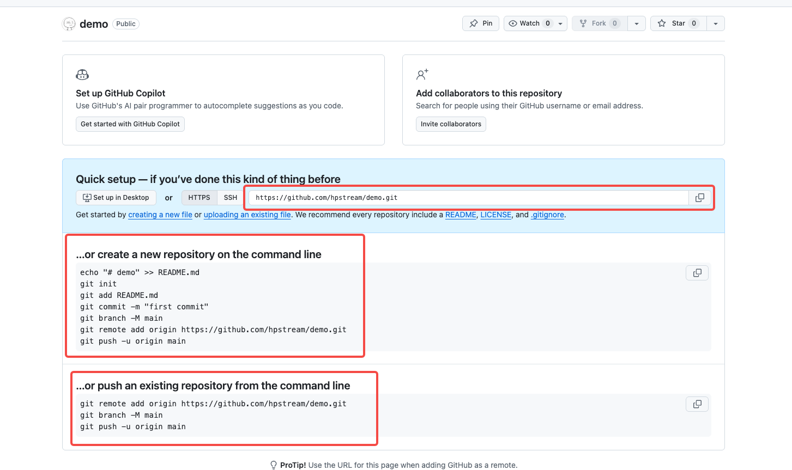

# 第 04 篇｜如何用 Git 拉代码、关联仓库、提代码（Mac 主线）

> 系列：专题实操
> 副标题：把 GitHub 上「Quick setup」那一页里的 3 块红框真正用起来。
> 标签：Git / clone / remote / push / 小白专用 / Mac
> 难度：⭐⭐ 入门实操
> 阅读时长：约 15 分钟
> 前置：已经按 [第 03 篇 如何安装 Git](./03-如何安装git.md) 装好了 Git，并已经有自己的 GitHub 仓库（不会的话先看 [第 02 篇 从 0 开始建立一个仓库](./02-从0开始建立一个仓库.md)）

---

## 这篇文章解决的卡点

你刚建好一个 GitHub 仓库，会看到一个页面叫 **Quick setup**，长这样：



这一页有 **3 块红框**：

1. 顶部红框：**HTTPS 仓库地址**
2. 中间红框：**…or create a new repository on the command line**
3. 底部红框：**…or push an existing repository from the command line**

很多新手会被吓到：「这么多命令，到底用哪一段？」

其实是因为它一次性给你列了 **3 种情况下要做的事**。
这一篇就帮你看懂：**什么时候用哪一段。**

---

## 三种情况一句话先说清楚

| 红框 | 情况 | 你电脑上现在的状态 |
|---|---|---|
| ① HTTPS 地址 | 想把这个 GitHub 仓库直接拉下来 | 本地**没有**这个项目 |
| ② create a new repository | 想在本地从 0 起一个新项目，再关联到这个仓库 | 本地**没有任何文件夹** |
| ③ push an existing repository | 想把本地已有的一个项目推上来 | 本地**已经有一个文件夹**，里面已经有些文件 |

后面 3 节就分别讲这 3 种情况。

---

## 情况一：直接 clone（对应红框 ①）

适合这种场景：

> 你已经有一个 GitHub 仓库（可能是你自己建的，可能是别人发给你的），你只是想把它整套拉到本地。

### 1) 从 Quick setup 里复制 HTTPS 地址

红框 ① 里那一串就是 HTTPS 地址，长得像：

```text
https://github.com/你的用户名/demo.git
```

点右边的复制按钮直接复制。

> 第一次先用 **HTTPS**，**不要管 SSH**。SSH 是后面才优化的事。

### 2) 在终端选一个工作目录

```bash
cd ~/Desktop
```

确认一下：

```bash
pwd
```

输出类似：

```text
/Users/你的用户名/Desktop
```

### 3) 执行 `git clone`

```bash
git clone https://github.com/你的用户名/demo.git
```

正常会看到类似输出：

```text
Cloning into 'demo'...
remote: Enumerating objects: 3, done.
Receiving objects: 100% (3/3), done.
```

当前目录下会多出一个文件夹 `demo/`，进去：

```bash
cd demo
git status
```

看到：

```text
On branch main
nothing to commit, working tree clean
```

就说明 **clone 成功了**。

### 这一步常见的两个坑

**坑 1：第一次会让你登录 GitHub**

如果以前没在这台 Mac 上用过 Git，clone 时浏览器会弹出来让你登录 GitHub，确认是你本人。
**走完即可**，是正常的。

**坑 2：明明仓库存在却报 404**

```text
remote: Repository not found.
fatal: repository 'https://github.com/xxx/demo.git/' not found
```

按这个顺序查：

1. URL 是不是抄漏了 `.git`、或者用户名写错
2. 仓库是不是 Private，但你这台 Mac 还没登 GitHub
3. **不要手敲**这个地址，直接在 Quick setup 里复制

---

## 情况二：从 0 起一个新项目并关联（对应红框 ②）

适合这种场景：

> 你本地什么都没有，准备**新建一个项目**，并且让它从一开始就和 GitHub 那个空仓库挂上钩。

GitHub 给你的那段命令长这样（红框 ②）：

```bash
echo "# demo" >> README.md
git init
git add README.md
git commit -m "first commit"
git branch -M main
git remote add origin https://github.com/你的用户名/demo.git
git push -u origin main
```

我一行一行讲：

### 1) 新建并进入项目目录

```bash
cd ~/Desktop
mkdir demo
cd demo
```

### 2) 创建一个 README

```bash
echo "# demo" >> README.md
```

意思是：往 `README.md` 里写一行 `# demo`，没有这个文件就新建。

### 3) 把当前目录初始化成 Git 仓库

```bash
git init
```

执行完后，目录下会多出一个隐藏的 `.git` 文件夹，这意味着这个文件夹从现在起就是一个 Git 仓库了。

### 4) 加入待提交 + 提交

```bash
git add README.md
git commit -m "first commit"
```

到这一步，**本地仓库里已经有第一笔提交了**，但还没有关联到 GitHub。

### 5) 把主分支统一叫 main

```bash
git branch -M main
```

GitHub 默认主分支叫 `main`，这一句是确保你本地的分支名也叫 `main`。

### 6) 关联远程仓库

```bash
git remote add origin https://github.com/你的用户名/demo.git
```

意思是：给当前本地仓库**加一个远端**，名字叫 `origin`，地址就是 GitHub 上那个仓库。

> 「origin」是一个起名约定，你 99% 的情况都会看到它。新手就照着用 `origin` 就好。

### 7) 推到 GitHub

```bash
git push -u origin main
```

含义：

- `push`：把本地内容推到远端
- `-u origin main`：把本地的 `main` 分支**绑定**到远端 `origin` 的 `main` 分支，以后直接 `git push` / `git pull` 就行，不用再写完整参数

回 GitHub 仓库主页刷新，你应该能看到刚才推上去的 `README.md` 和 commit message `first commit`。

### 这一步常见的坑

**坑：新建仓库时勾过 “Add README”，然后你又用了这段**

报错会长这样：

```text
! [rejected]        main -> main (fetch first)
error: failed to push some refs
hint: Updates were rejected because the remote contains work that you do
hint: not have locally.
```

原因：你本地是 `first commit`，但 GitHub 那边已经有它自己自动生成的 README，两边对不上。

最简单的处理：

```bash
git pull --rebase origin main
git push -u origin main
```

意思是：先把远端的内容拉下来合并，再推上去。

> 想避免这个坑也很简单：**新仓库不要勾 Add README**，让它是空仓库，再用情况二那段就不会冲突。

---

## 情况三：本地已经有一个文件夹，想关联到新仓库（对应红框 ③）

适合这种场景：

> 你本地早就有一个项目文件夹（可能写了几天代码了），只是想把它推到 GitHub 上去。

GitHub 给你的那段命令长这样（红框 ③）：

```bash
git remote add origin https://github.com/你的用户名/demo.git
git branch -M main
git push -u origin main
```

注意比情况二**少了**：

- `mkdir demo`
- `git init`
- `git add` / `git commit`

因为它的前提是：**你本地这个项目已经是一个 Git 仓库，并且已经有提交了。**

### 完整真实步骤

#### 1) 进入你本地这个项目目录

```bash
cd /Users/你的用户名/Desktop/已有的项目目录
```

#### 2) 如果还不是 Git 仓库，先初始化一下

先看一眼：

```bash
git status
```

- 看到 `fatal: not a git repository` → 还不是 Git 仓库，需要初始化
- 看到 `On branch main` 或 `On branch master` → 已经是 Git 仓库，跳到第 4 步

如果需要初始化：

```bash
git init
git add .
git commit -m "first commit"
```

#### 3) 改名为 main 分支

```bash
git branch -M main
```

#### 4) 关联远程仓库

```bash
git remote add origin https://github.com/你的用户名/demo.git
```

#### 5) 第一次推上去

```bash
git push -u origin main
```

到这一步，**你本地早就有的那个项目**就已经推到 GitHub 仓库里了。

### 这一步常见的坑

**坑 1：已经关联过 origin**

```text
fatal: remote origin already exists.
```

意思是这个本地仓库以前就被关联过另一个远端。
处理：

```bash
git remote remove origin
git remote add origin https://github.com/你的用户名/demo.git
```

**坑 2：远端仓库已经有 README（同情况二的那个坑）**

```text
! [rejected]        main -> main (fetch first)
```

处理：

```bash
git pull --rebase origin main
git push -u origin main
```

---

## 三种情况怎么选？一眼看

| 你现在的状态 | 用哪一种 | 关键命令 |
|---|---|---|
| 本地什么都没有，想拿一个现成仓库 | 情况一 clone | `git clone <https url>` |
| 本地什么都没有，准备从 0 写新项目 | 情况二 新建 + 关联 | `git init` + `git remote add origin ...` + `git push -u origin main` |
| 本地早就有项目文件夹了，只想推上去 | 情况三 已有文件夹关联 | `git remote add origin ...` + `git push -u origin main` |

简单记法：

- **本地没文件夹** → 情况一
- **本地准备建新文件夹** → 情况二
- **本地早就有文件夹** → 情况三

---

## 之后日常改代码的三连命令

不管你是上面哪种情况起步的，**只要建立好本地 ↔ GitHub 的连接**，以后日常改代码全部都是这一组：

```bash
git add .
git commit -m "你这次改了什么"
git push
```

> 99% 的日常工作就是这 3 行。

---

## 这几个常见疑问，先回答你

### Q1. push 报错说 `Authentication failed`？

意思是 GitHub 不知道你是不是仓库主人，**这是认证问题，不是命令打错**。

最常见的两种处理：

1. 让浏览器弹出来的 GitHub 登录走完
2. 如果一直失败，去 GitHub → Settings → Developer settings → **Personal access tokens**，生成一个 token，让你输入密码时**用 token 代替密码**

### Q2. 一定要用 `main` 这个分支名吗？

不一定，但**强烈建议**。
GitHub 现在默认分支就是 `main`，跟着走最不容易出错。
老仓库可能叫 `master`，看到一样不要慌，意思是一样的。

### Q3. 写 commit message 有什么讲究？

一句话总结你改了什么。例子：

- `update README`
- `add login page`
- `fix typo in homepage`

不要写：

- `1`、`asdf`、`修改了`

你以后看自己的 commit 记录就懂这个建议为什么重要了。

---

## 小结

这篇你实际完成了 3 件事：

1. 看懂了 GitHub 新仓库那一页里 **3 块红框分别是什么场景**
2. 知道了：

   - 没文件夹 + 想拿现成仓库 → `git clone`
   - 没文件夹 + 想从 0 写 → 用情况二那段
   - 已有文件夹 → 用情况三那段

3. 学会了之后日常改代码的三连命令：

   ```bash
   git add .
   git commit -m "你这次改了什么"
   git push
   ```

---

## 下一步去哪？

到这一步，你已经把 GitHub + Git 的最小闭环跑通了。
后面比较自然的方向有两个，看你需要：

- 用 GitHub 接 Vercel，让代码改动**自动部署**到线上
- 学一下 Git 分支、PR、协作流程

哪条路有需要，我们再单独开一篇讲。

---

## 练习题（附答案）

### 1. 你刚建好一个 GitHub 仓库，本地什么都没有，准备从 0 开始写新项目，应该用哪一段？

**答案：**
用情况二那段（红框 ②）。
关键步骤：

```bash
mkdir demo && cd demo
git init
git add .
git commit -m "first commit"
git branch -M main
git remote add origin https://github.com/你的用户名/demo.git
git push -u origin main
```

### 2. 你本地早就有一个写了一周的项目文件夹，现在才想推到 GitHub，应该用哪一段？

**答案：**
用情况三那段（红框 ③）。
关键步骤：

```bash
cd 已有的项目目录
# 如果还不是 git 仓库，先 git init / add / commit
git branch -M main
git remote add origin https://github.com/你的用户名/demo.git
git push -u origin main
```

### 3. push 报错 `! [rejected] main -> main (fetch first)`，最可能是什么原因？

**答案：**
远端仓库里有你本地没有的提交（例如新建仓库时勾了 Add README）。
处理：

```bash
git pull --rebase origin main
git push -u origin main
```
